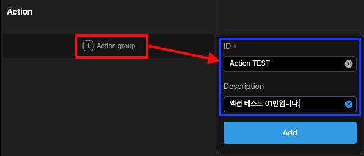
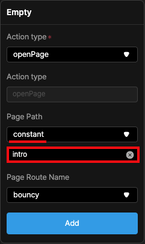

# Action
여러가지 이벤트를 설정할 수 있습니다. 크게 트리거를 통한 액션과 상태감시 혹은 시간을 두고 처리하는 액션으로 구분됩니다.

   

### Action ID 부여하기
이 ID 를 통해서 외부에서 이벤트를 요청받습니다. 유일한 이름을 설정합니다.

최초에 액션의 그룹이름을 정해 주어야 합니다. 그 그룹의 이름으로 이벤트를 처리하게 하기 위함입니다. 
 
Style Property -> GestureDetector 혹은 JAVA 스크립트를 이용해서 해당 액션을 실행하게 됩니다.
( 관련문서 링크 !! 작성되면 연결 )

 
 

### Action Type 
크게  Trigger 와 Condition & periodic 2가지로 구분됩니다.
 
Trigger 는 이벤트를 통해서 액션을 실행하고, Condition & periodic 의 경우는 상태감시 및 시간이 지남에 따라서 액션을 실행합니다.

01. empty
02. delay
03. openPage
04. openBackPage
05. openSheet
06. openDrawer
07. navigatorPop
08. openDialog
09. toastShow
10. updateVar
11. clearVar
12. exeEventResponse
13. requestData
14. subscribeData
15. unsubscribeData
16. loadFile
    
### Condition & periodic
17. condition
18. periodic

위의 예시는 신규 Action 을 등록하고  그 명칭은 "Action TEST" 입니다.  
이는 다른 화면을 Open 하는 것으로 intro 라는 파일을 열기 위한 과정을 보여줍니다.

  

- empty  
 : 빈 액션을 등록하는 것으로 매세지, 혹은 로그를 남기기 위함이나 특정한 행동을 할 필요가 없는 액션을 등록합니다.
     
  
    

- delay  
  :연속적인 액션중에 지연을 주기 위한 액션입니다. Delay 설정값은 milisecond 입니다.
     
  
    

- openPage  
  : 새로운 페이지를 엽니다. 새로운 패이지를 여는 방식은 여러가지가 있으며 페이지 제일 아래를 참조바랍니다.
   
  아래의 예시는 같은 경로내에 있는 intro 라는 Page(File단위) 를 여는 설정으로 여는 파일명은  
  직접입력하며 (constant), 파일명은 (intro) 입니다.
     
   
    [openPage  참조](/simple_app/openPage.md)
    

- openBackPage  
  : 열려있는 페이지(p2)를 닫고 이전화면(p1)으로 되돌아 갑니다. 이는 먼저 openPage Action을 한 이후에 가능합니다. 새로운 창에서 작업이 완료된 경우, 닫아야 할때 openBackPage 를 실행합니다. p1에서 openPage를 이용해서 열린 page(p2번) 를 닫고 기존페이지(p1)로 다시 돌아옵니다. 즉 부모 Page가 있어야 합니다.
     
  
  
    

- openSheet  
  : 페이지를 아래에서 위로 새로 열립니다. 여는 방식의 차이입니다. 
     
  
  &nbsp;&nbsp;&nbsp;&nbsp;&nbsp;&nbsp;&nbsp;&nbsp;&nbsp;&nbsp;&nbsp;&nbsp;&nbsp;&nbsp;&nbsp;
  
  < 구글페이지의 openSheet 방식 >
    

- openDrawer  
  : 신규페이지를 왼쪽 혹은 오른쪽으로 엽니다. 사이즈는 열리는 페이지의 크기에 영향을 받습니다.
     
  
   
    "Drawer is left show" 를 통해서 왼쪽, 오른쪽에서 열리는 방향을 정합니다. 
   
   
  
  &nbsp;&nbsp;&nbsp;&nbsp;&nbsp;&nbsp;&nbsp;&nbsp;&nbsp;&nbsp;&nbsp;&nbsp;&nbsp;&nbsp;&nbsp;&nbsp;&nbsp;&nbsp;&nbsp;&nbsp;&nbsp;&nbsp;&nbsp;&nbsp;&nbsp;&nbsp;&nbsp;&nbsp;&nbsp;&nbsp;
  
   
  <왼쪽에서 열리는 형태>
  &nbsp;&nbsp;&nbsp;&nbsp;&nbsp;&nbsp;&nbsp;&nbsp;&nbsp;&nbsp;&nbsp;&nbsp;&nbsp;&nbsp;&nbsp;&nbsp;&nbsp;&nbsp;&nbsp;&nbsp;&nbsp;&nbsp;&nbsp;&nbsp;&nbsp;&nbsp;&nbsp;&nbsp;&nbsp;&nbsp;
  &nbsp;&nbsp;&nbsp;&nbsp;&nbsp;&nbsp;&nbsp;&nbsp;&nbsp;&nbsp;&nbsp;&nbsp;&nbsp;&nbsp;&nbsp;&nbsp;&nbsp;&nbsp;&nbsp;&nbsp;&nbsp;&nbsp;&nbsp;&nbsp;&nbsp;&nbsp;&nbsp;&nbsp;&nbsp;&nbsp;
  <오른쪽에서 열리는 형태>

     
- navigatorPop
   
  : 팝업으로 열린 화면을 삭제합니다. Popup 과 OpenPage 의 차이점은 Popup은 스택형태로 화면이 쌓인 형태이고,
   
   OpenPage 는 기존의 화면을 신규화면으로 교체 합니다.
     
   
    

- openDialog 
   
  : 화면의 가운데 Dialog 창을 띄웁니다. Full Dialog창의 경우는 화면전체를 띄웁니다.
     
  
    

- toastShow
   
  : 화면의 하단에 토스트 메세지를 보여줍니다. 아래에서 위로 뜨며 Toast Type 에 따라서 창의 색상이 달라집니다.
     
  
   
  Toast Type
  1. normal
  2. error
  3. warning
  4. success
  5. notify
   
   
메세지를 올리는 정보는 다음과 같습니다.
1. constant : 아래 창에 입력한 형태를 그대로 출력합니다.
2. dataPath : CDS의 필드이름을 입력하고 해당 필드의 들어가있는 정보를 출력합니다.
3. variable : 저장된 변수에 들어가있는 정보를 출력합니다.
4. propPath :  
5. actionResult : 콜백으로 받은 Action 의 결과값을 출력합니다.
6. formula : 
  

- updateVar
   
  : 변수를 저장, Update 합니다. 미리 등록된 변수 app, page, form 변수에 정보를 저장합니다.
       
  
  &nbsp;&nbsp;&nbsp;&nbsp;&nbsp;&nbsp;&nbsp;&nbsp;&nbsp;&nbsp;&nbsp;&nbsp;&nbsp;&nbsp;&nbsp;&nbsp;
  
   
  왼쪽의 것은 page변수 "Tower"를 Global변수 "VarScope.app.\$globalOffset.x" 에 저장합니다. 
  오른쪽의것은 직접입력하는 값을 Global변수 "VarScope.app.$globalOffset.x" 에 저장합니다. 

    
  
   
  저장하는 내용도 위와 같습니다.
    즉 미리 등록된 변수에, 다른변수를 저장할수도 있고, 특정 DS의 정보, 고정된 값등 방법은 여러가지로 구현이 가능합니다.
   
  (constant , dataPath , variable , propPath , actionResult , formula)

  
- clearVar  
  : 변수에 저장된 값을 삭제합니다. 초기화와 동일합니다.

  
- exeEventResponse  
  : 이벤트가 완료된후 실행합니다. 여기서 따로 등록된 여러가지의 이벤트들을 연결할수 있습니다.
   
  예를들어 화면을 여는 Action 과 열린화면의 이름을 토스트메세지로 보여주기를 원한다면
  OpenPage, UpdateVar, ToastMessage 를 연속적으로 조합해서 사용합니다. 
  동시에 실행하는 것이 아닌, 선행되는 액션이 완료되면 실행하므로 액션이 순차적으로 연계해서 사용할수 있습니다.

  아래의 등록된 이벤트들은 그 예시를 보여줍니다. <-- 작성해>

  
- requestData  
 : 서비스 요청을 합니다. 요청된 서비스는 ProvInstance 를 통해서 통신됩니다.
   선택한 서비스명을 요청합니다.

  
- subscribeData  
  :실시간 TR을 등록합니다. 요청된 서비스는 ProvInstance 를 통해서 통신됩니다.
  선택한 서비스명을 요청합니다.

  
- unsubscribeData  
  : 등록된 실시간 TR 를 해제합니다. 등록된 ProvInstance 해지합니다.
  선택한 서비스명을 해제합니다.

  
- loadFile  
: 파일을 읽어서 정보를 가져옵니다. 파일을 읽는 방법은 다음과 같습니다.  
  (constant , dataPath , variable , propPath , actionResult , formula)

  아래의 예시는 jongmok.json 파일을 읽는 방법을 보여줍니다.
   
  읽은 파일을 데이터 형태로 바꾸기 위해서는 먼저 해당정보를 ProvInst 에 등록해야합니다.

  [ProviderInstance 등록과정은 5번 ProviderInstance Regist 참조](/lucy_studio/panel_tabbar/panel_tabbar.md)
 

  등록된 ProvInstance 를 연결하면 과정이 완료됩니다.

  [ListView 위젯에 파일정보를 읽어 등록하는 과정<<--- 연결재대로 해야함](/lucy_studio/plate_tabbar/plate_tabbar.md)

  

### Condition & periodic
17. condition
18. periodic

[참조] https://api.flutter.dev/flutter/dart-ui/Clip.html