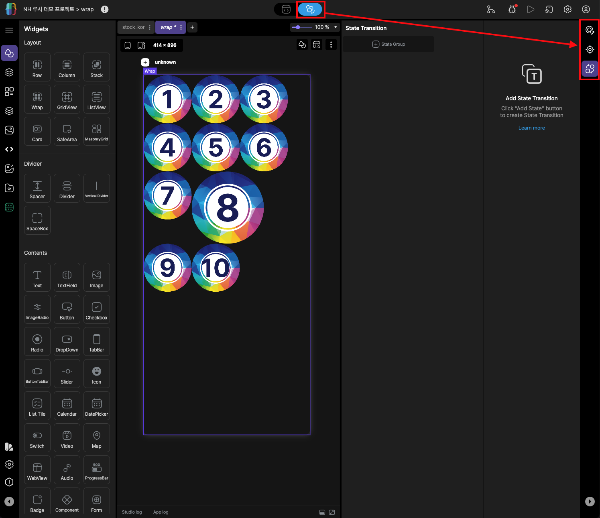
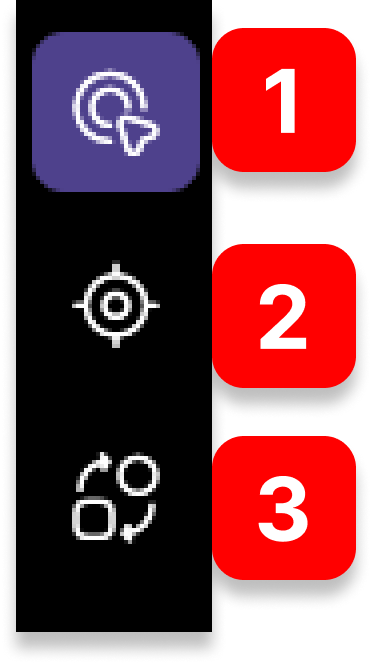

# Animation mode
3가지의 서브메뉴로 이루어져 있으며 Studio 우측에 활성화됩니다.

 

  

> 

 

## 1. Action
여러가지 이벤트를 설정할 수 있습니다. 크게 트리거를 통한 액션과 상태감시 혹은 시간을 두고 처리하는 액션으로 구분됩니다.
[연결](/lucy_studio/action_bar/Action.md)

## 2. Detect
추후 제작중입니다.
[연결](/lucy_studio/action_bar/Detect.md)

## 3. State Transition
화면에서 위젯의 애니메이션 효과를 추가, 또는 변경을 할 수 있습니다.
[연결](/lucy_studio/action_bar/StateTransition.md)

