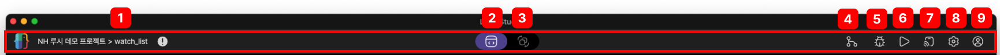
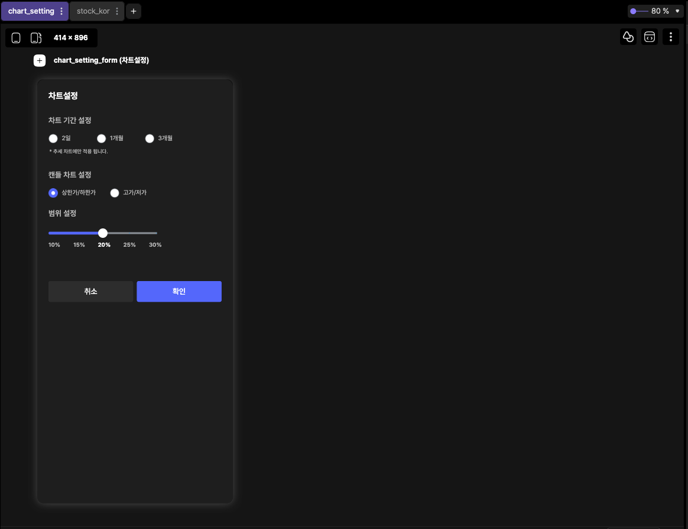
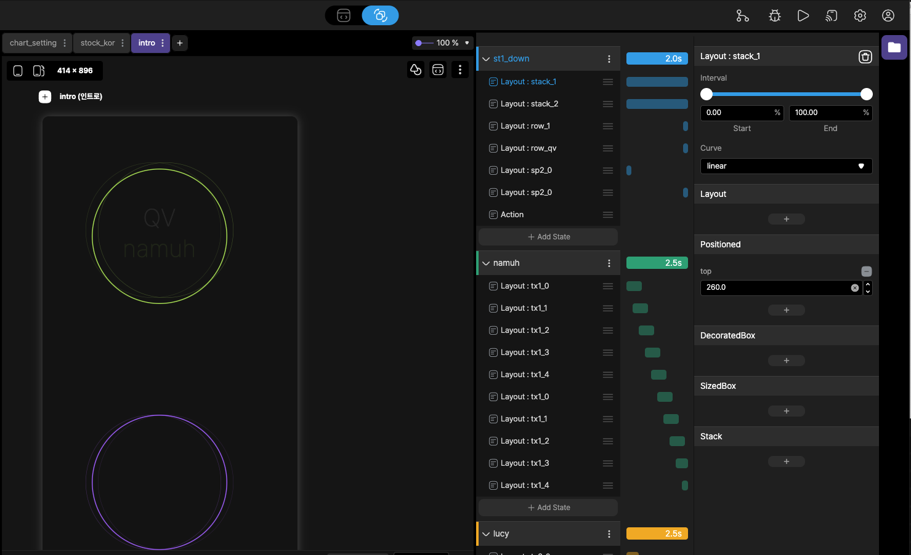

# action bar 

action bar는 Lucy Studio 상단에 있습니다.
프로젝트 경로, Stage Transition, Git, Bug Viewer, Run, Device Sync, 설정, Profile의 정보를 제공합니다.

 
 
 

### 1. 프로적트 경로

현재 개발하고 있는 프로젝트의 경로 디렉토리가 표시 됩니다.

 
 
 

### 2. Canvas Area

Canvas 영역에서 위젯들의 배치 또는 스크립트를 통해서 화면을 그리는 영역을 담당합니다.

 
 
 

### 3. State Transition

화면에서 위젯의 애니메이션 효과를 추가, 또는 변경을 할 수 있습니다.  

