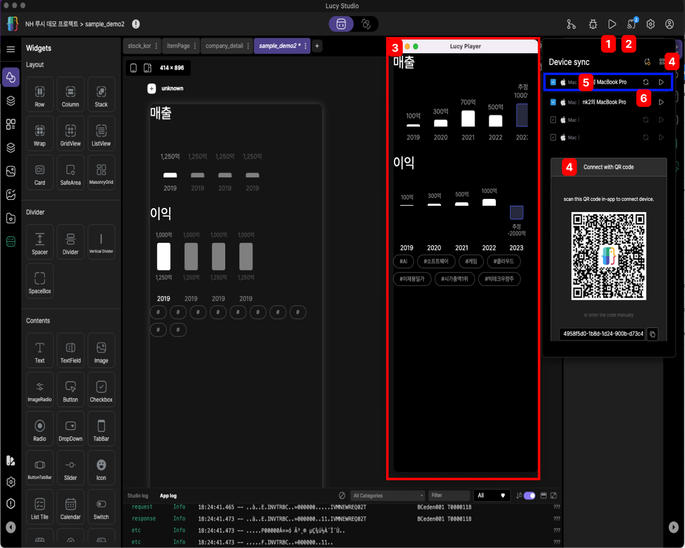
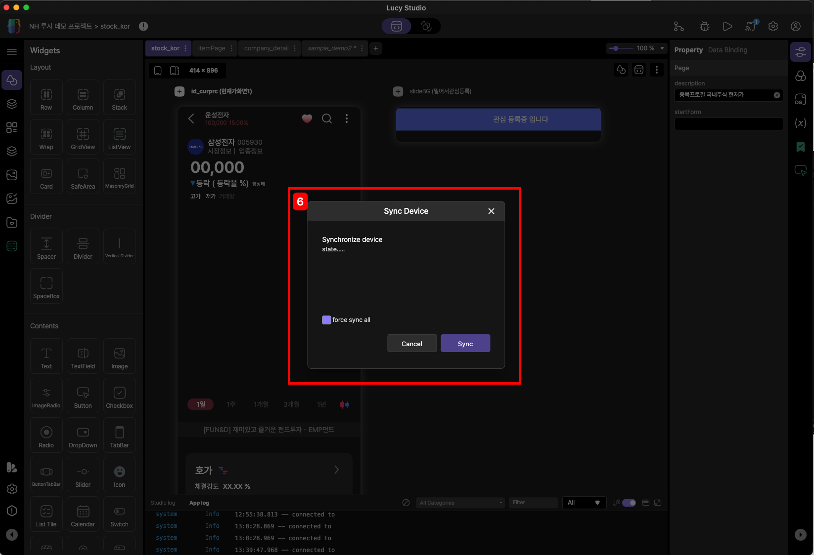
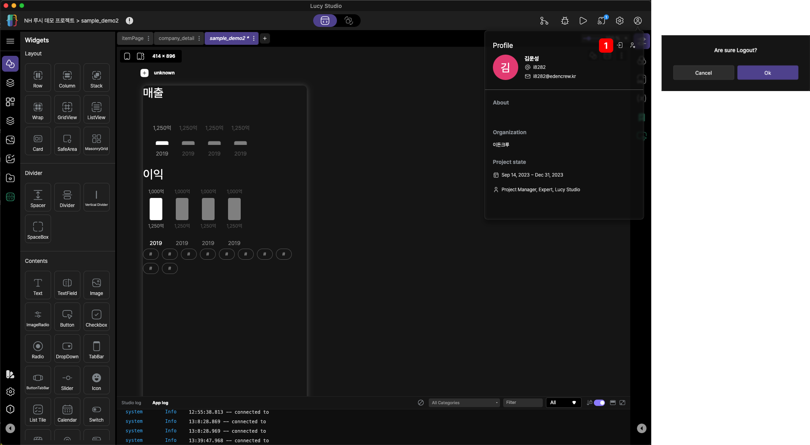
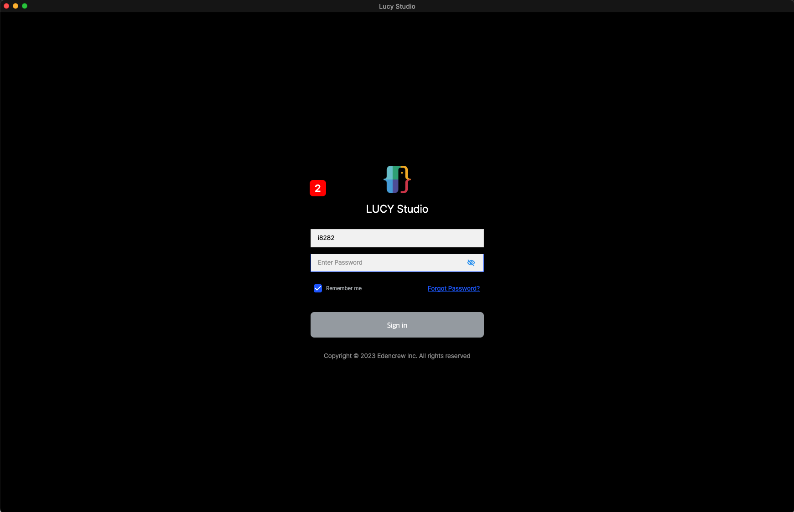

# action bar 

action bar는 Lucy Studio 상단에 있습니다.
프로젝트 경로, Stage Transition, Git, Bug Viewer, Run, Device Sync, 설정, Profile의 정보를 제공합니다.

 
 
 

### 1. 프로적트 경로

현재 개발하고 있는 프로젝트의 경로 디렉토리가 표시 됩니다.

 
 
 

### 2. Canvas Area

Canvas 영역에서 위젯들의 배치 또는 스크립트를 통해서 화면을 그리는 영역을 담당합니다.

 
 
 

### 3. State Transition

화면에서 위젯의 애니메이션 효과를 추가, 또는 변경을 할 수 있습니다.  

 
 
 

### 4. Git

오픈소스에서 제공하는 git의 형상관리 툴이 Lucy Studio에 내장되어 있습니다.
기 제공하는 Git가 같은 기능을 제공합니다.

<참고1>

 

<참고2>

<참고3>

<참고4>

<참고5>

#### &nbsp;&nbsp;&nbsp;&nbsp;&nbsp;&nbsp;&nbsp;&nbsp;&nbsp;&nbsp; 1. Unstaged files
&nbsp;&nbsp;&nbsp;&nbsp;&nbsp;&nbsp;&nbsp;&nbsp;&nbsp;&nbsp; &nbsp;&nbsp;&nbsp;&nbsp;&nbsp; 로컬 저장소에서 작업한 작업 내역이 표시됩니다.

#### &nbsp;&nbsp;&nbsp;&nbsp;&nbsp;&nbsp;&nbsp;&nbsp;&nbsp;&nbsp; 2. Staged files
&nbsp;&nbsp;&nbsp;&nbsp;&nbsp;&nbsp;&nbsp;&nbsp;&nbsp;&nbsp; &nbsp;&nbsp;&nbsp;&nbsp;&nbsp; 서버 저장소에 적용할 작업 내역입니다.

&nbsp;&nbsp;&nbsp;&nbsp;&nbsp;&nbsp;&nbsp;&nbsp;&nbsp;&nbsp;&nbsp;&nbsp;&nbsp;&nbsp;&nbsp;&nbsp;&nbsp;(ex) Unstaged files 체크박스를 클릭 시 위 <9번>항목으로 이동합니다.

#### &nbsp;&nbsp;&nbsp;&nbsp;&nbsp;&nbsp;&nbsp;&nbsp;&nbsp;&nbsp; 3. History 
&nbsp;&nbsp;&nbsp;&nbsp;&nbsp;&nbsp;&nbsp;&nbsp;&nbsp;&nbsp; &nbsp;&nbsp;&nbsp;&nbsp;&nbsp; 원격저장소에서 여러 팀원이 작업한 내역을 표시합니다.

#### &nbsp;&nbsp;&nbsp;&nbsp;&nbsp;&nbsp;&nbsp;&nbsp;&nbsp;&nbsp; 4. Commit
&nbsp;&nbsp;&nbsp;&nbsp;&nbsp;&nbsp;&nbsp;&nbsp;&nbsp;&nbsp; &nbsp;&nbsp;&nbsp;&nbsp;&nbsp; Staged files에 지정된 목록을 커밋 기록을 적용하기 위한 단계입니다.

&nbsp;&nbsp;&nbsp;&nbsp;&nbsp;&nbsp;&nbsp;&nbsp;&nbsp;&nbsp;&nbsp;&nbsp;&nbsp;&nbsp;&nbsp;&nbsp;&nbsp;(ex) Commit 클릭 시 <10번>항목의 팝업이 나타나며 코멘트 필수 입력 후에 Commit 버튼을
클릭하시면 커밋 기록에 저장됩니다.

#### &nbsp;&nbsp;&nbsp;&nbsp;&nbsp;&nbsp;&nbsp;&nbsp;&nbsp;&nbsp; 5. Pull
&nbsp;&nbsp;&nbsp;&nbsp;&nbsp;&nbsp;&nbsp;&nbsp;&nbsp;&nbsp; &nbsp;&nbsp;&nbsp;&nbsp;&nbsp; 원격저장소에 저장되어 있는 파일 목록을 로컬저장소와 동기화를 적용합니다.

&nbsp;&nbsp;&nbsp;&nbsp;&nbsp;&nbsp;&nbsp;&nbsp;&nbsp;&nbsp;&nbsp;&nbsp;&nbsp;&nbsp;&nbsp;&nbsp;&nbsp;Pull버튼을 클릭하시면 <참고5>의 원격저장소와 로컬저장소의 동기화가 이루어 집니다.

#### &nbsp;&nbsp;&nbsp;&nbsp;&nbsp;&nbsp;&nbsp;&nbsp;&nbsp;&nbsp; 6. Push
&nbsp;&nbsp;&nbsp;&nbsp;&nbsp;&nbsp;&nbsp;&nbsp;&nbsp;&nbsp; &nbsp;&nbsp;&nbsp;&nbsp;&nbsp;새롭게 생성한 원격 리포지토리에 기존 커밋 기록을 옮기거나, 기존 원격 리포지토리에서 일부 변경된 내용을 옮기는데 사용할 수 있습니다. 

#### &nbsp;&nbsp;&nbsp;&nbsp;&nbsp;&nbsp;&nbsp;&nbsp;&nbsp;&nbsp; 7. Fetch
&nbsp;&nbsp;&nbsp;&nbsp;&nbsp;&nbsp;&nbsp;&nbsp;&nbsp;&nbsp; &nbsp;&nbsp;&nbsp;&nbsp;&nbsp; 로컬 Git에게 원격 저장소에서 최신 메타데이터 정보를 확인하라는 명령을 전달합니다.

&nbsp;&nbsp;&nbsp;&nbsp;&nbsp;&nbsp;&nbsp;&nbsp;&nbsp;&nbsp;&nbsp;&nbsp;&nbsp;&nbsp;&nbsp;&nbsp;&nbsp;단 fetch 는 원격 저장소에 변경사항이 있는지 확인만 하고, 변경된 데이터를 로컬 Git에 실제로 가져오지는 않습니다.

#### &nbsp;&nbsp;&nbsp;&nbsp;&nbsp;&nbsp;&nbsp;&nbsp;&nbsp;&nbsp; 8. Close
&nbsp;&nbsp;&nbsp;&nbsp;&nbsp;&nbsp;&nbsp;&nbsp;&nbsp;&nbsp; &nbsp;&nbsp;&nbsp;&nbsp;&nbsp; 해당 윈도우창을 닫습니다. 

 
 
 

### 5. Bug Viewer

추후 제공합니다.

 
 
 

### 6. Run

디바이스 사이즈에 맞게 Lusy Player를 실행합니다. 

 
 

### 7. Device Synchronization(기기 동기화)

Lucy Player의 실행이나 디바이스에 데이터 또는 이미지가 추가된 경우 실시간으로 동기화를 지원합니다. 

 

 
 

 
 

> 1. Run
> 
>      디바이스 사이즈에 맞게 Lusy Player를 실행합니다.
> 
> 2. Device Synchronization
> 
>      Lucy Player의 실행, 데이터, 이미지의 동기화를 지원합니다.
> 
> 3. Lucy Player
> 
>      모바일과 동일한 UI환경으로 빠르게 화면구성 및 연동을 확인하실 수 없습니다.
> 
> 4. Connect with QR Code
> 
>      QR Code로 스캔이나 코드 복사를 통해서  모바일 환경으로 테스트가 가능합니다.
>
> 5. Lucy Player에 연결되어 있는 디바이스
>
> 6. Sync Device
>
>      상단 <6번>를 클릭하면 아래 그림 <6번>의 윈도우창이 나타나며 데이터의 변경, 이미지 추가 시에 동기화를 하면 Lucy Player에 실시간 반영됩니다. 
> 
> 

 

### 8. Preferences

추후 제공합니다.
 
 
 
 

### 9. Profile

내가 참가하고 있는 간단한 프로필 항목을 보여줍니다.

 

 
 

 
 
 

> 1. Logout
> 
>      로그아웃 클릭 시 오른쪽 이미지의 모달창이 표시되며 "OK"버튼을 클릭 시 로그인 화면으로 이동합니다.
>
> 
>      