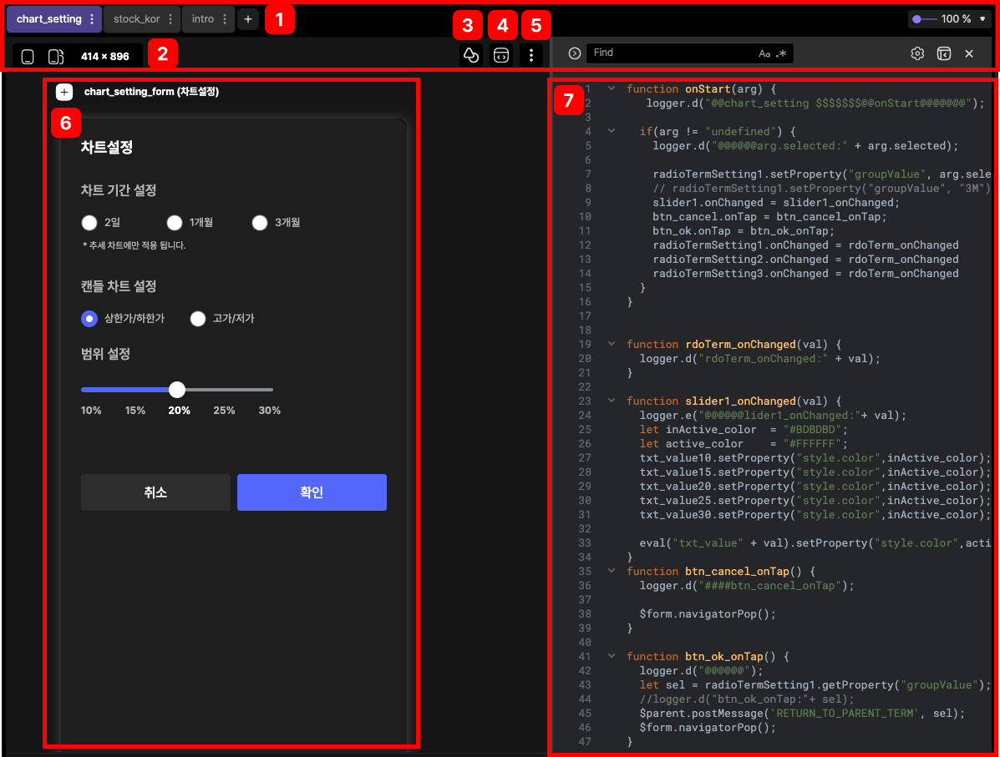
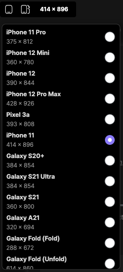
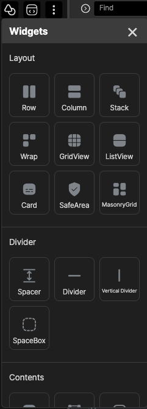
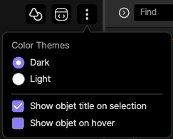

# canvas area

canvas area는 Lucy Studio 가운데에 있습니다.
화면UI 추가 및 변경, script 편집창을 통해서 원하는 화면을 만들 수 있습니다.

 
 
 

### 1. page tabs

활성화 된 프로젝트에서 화면을 표시되는 리스트 입니다.

 
 
 

### 2. device size

다양한 모바일 기기를 선택하면 다른 사이즈로 기기의 화면 테스트가 가능합니다.

 
 
 

### 3. widget tool

위젯목록에서 위젯을 선택해서 화면에 드래그 앤 드랍을 하시면 해당 위젯이 화면에 표시됩니다.

 
 
 

### 4. script show/hide

script 편집창을 활성화, 비활성화를 할 수 있습니다.

 
 
 

### 5. 테마변경

Lucy Studio 툴의 테마를 변경할 수 있습니다.

 
 
 

### 6. canvas

화면에 위젯을 추가해서 디자인 구성이 가능하며
디자인 된 화면을 리얼타임으로 미리볼 수 있습니다.

 
 
 

### 7. script 편집창

전문가 모드로 자바스크립트를 통해서
화면에서 쓰이는 이벤트, CDS, State Transition 등 직접적으로 화면의 제어가 가능합니다.  

 
 
 
