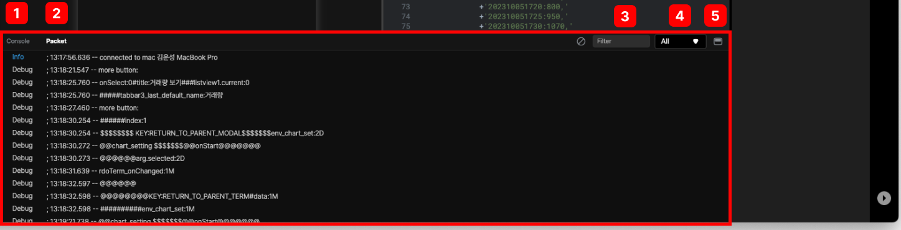

# log bar

프로그램 개발을 용이하게 하기 위해서 에러가 발생 시 간단하게 변수의 값 등의 log정보 체크가 가능합니다.

 
 
 

### 1. Console   
 
 
 

### 2. Packet
 
빠른 개발을 위하여 데이터 통신, 프로그램 오류, 디버킹 정보를 보여주는 화면입니다.    

 
 
 

### 3. 검색
Packet에 정의된 log항목 리스트에 키워드를 입력하면 해당 키워드가 검색됩니다.

 
 
 

### 4. 로그유형
log의 유형은 All, Info, Warning, Error, Debug로 나누어지며
컴포박스 선택 시 해당유형의 log를 볼 수 있습니다.

 
 
 

### 4. Show/Hide
log bar창을 활성화, 비활성화 할 수 있습니다.

 
 
 