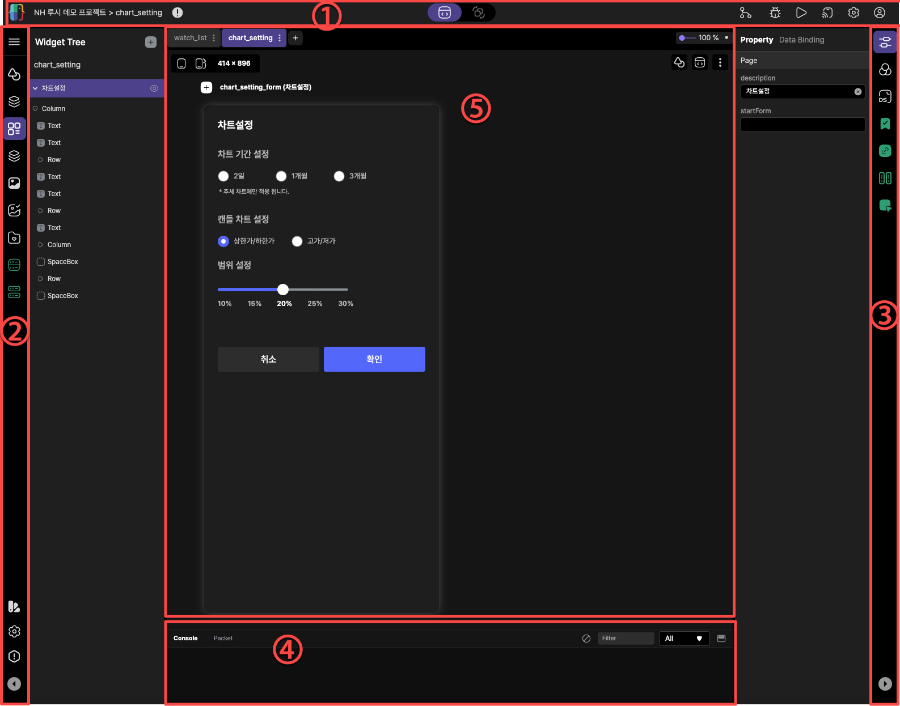

# Lucy Studio Builder

* 프로젝트 창을 여시면 plate tabbar, action bar, canvas area, panel tabbar, debug창으로 구성됩니다.

### 1. action bar
프로젝트 경로, animation mode, Git, Bug Viewer, Run, Device Sync, 설정, Profile의 정보를 제공합니다.

### 2. plate tabbar
Widgets, Pages 화면, Widgets tree, Components, Images, Assets Explorer, My Widgets, Data Provider, state transition 등등의 정보를 제공합니다.

### 3. panel tabbar 
properties, Styles, Data Source, Provider Instance, CDS, Data Binding, Action 기능을 제공합니다.

### 4. packet 정보
프로그램 개발을 용이하기 위해서 로그 등의 정보를 이용해서 개발을 쉽게 개발이 가능합니다.

### 5. canvas area
plate tabbar, 화면UI, script 편집창 등등의 정보를 제공합니다.