# panel tabbar

properties, Styles, Data Source, Provider Instance, CDS, Data Binding, Action 기능을 제공합니다.

 
 
 

### 1. Properties
 
   
   property는 선택된 위젯의 색상, 폰트크기 등 여러가지 옵션을 변경할 수 있습니다.

 

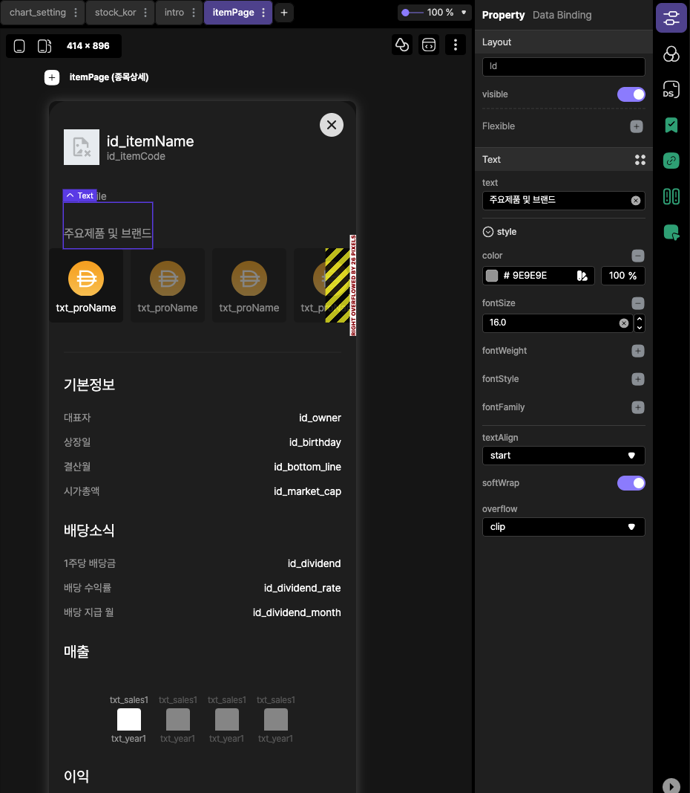

 
 
 

> &nbsp;
> 
> Data Binding
> 
>    1. Provider를 통해서 연동 된 데이터셋을 Provider Instance로 생성합니다.
> 
>    2. 생성 된 Provider Instance를 Data Source와 연동합니다.
> 
>    3. 연동 된 Data Source와 위젯의 고유 ID를 통해서 위젯의 값 또는 옵션 등의 연결을 지원합니다.  
>
> &nbsp;

 

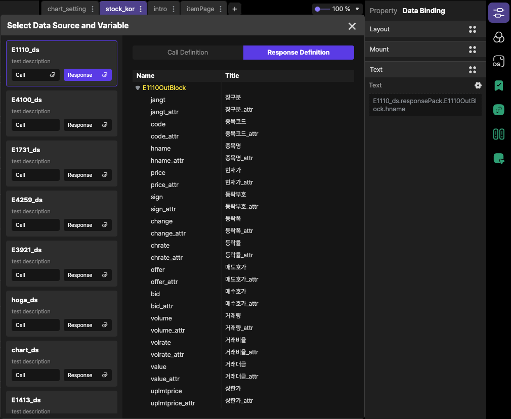

 
 

### 2. Styles

 
 
선텍하신 위젯의 확장기능으로 SizedBox(크기변경), Padding(여백조절)등등 여러가지 옵션으로 멀티로 추가가 가능하며 
원하시는 디자인에 최적화가 가능합니다. 

 

 

> &nbsp;
> 1. 검색
> 
>     확장가능한 Style 위젯의 검색이 가능합니다.
> 
> 2. Recently
>
>     추가한 Style 위젯의 히스토리 목록이 나타납니다.
>
> 3. 추가 가능한 위젯
>     선택 가능한 Style 위젯목록이 나타납니다.
>
> 4. 추가 된 위젯
>
>      추가한 위젯목록이 나타납니다.
>
> 5. 플러스 아이콘
>
>      선택하신 위젯의 위,아래에 Style 위젯 추가가 가능합니다.(동일 위젯으로 중복 사용 가능합니다.)
> 
> &nbsp;

 
 
 

### 3. Data Source
 

서버에 정의되어 있는 데이터 정보를 설정해서 필요한 필드정보를 가져올 수 있습니다. 

<첨부1>

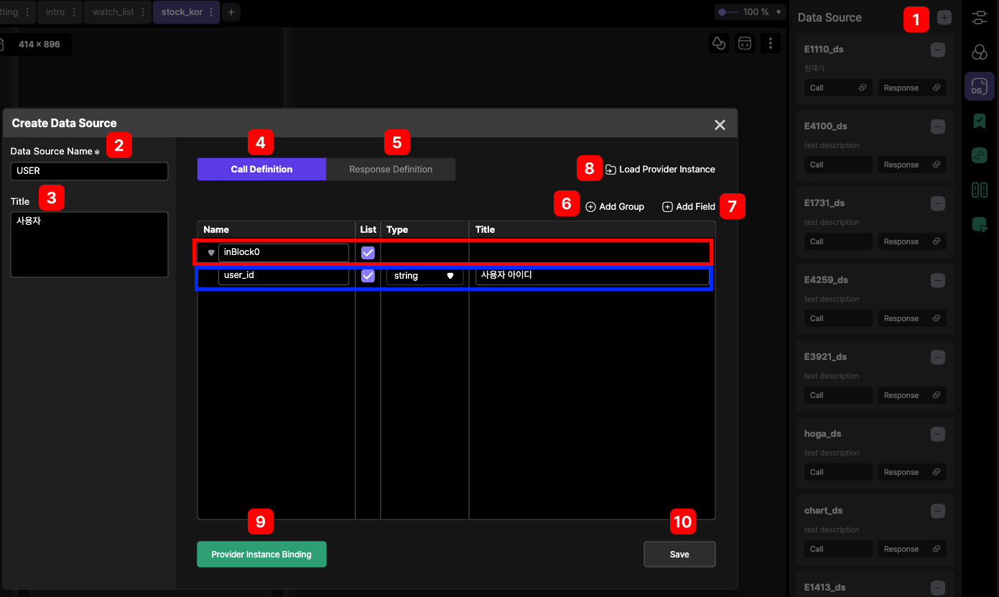

<첨부2>

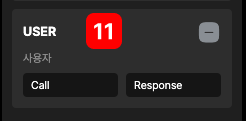

<첨부3>

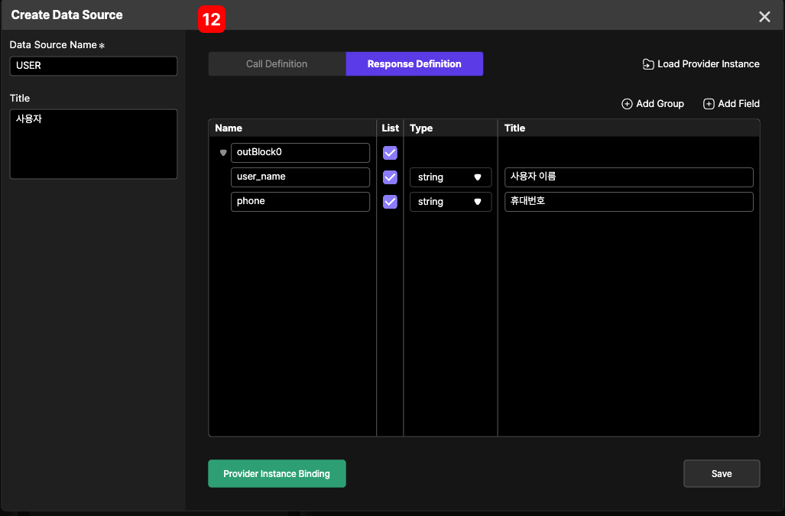

<첨부4>

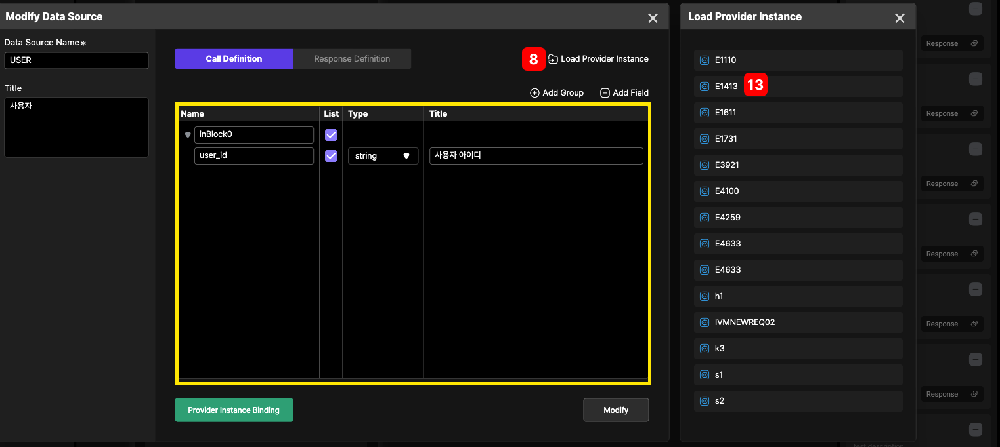

<첨부5>

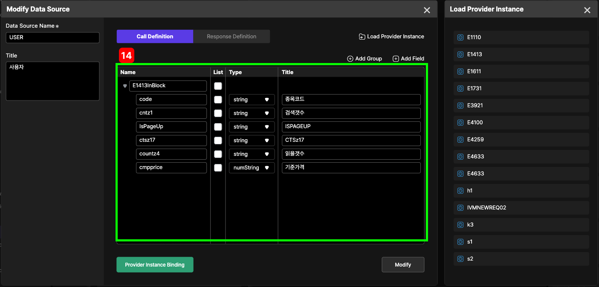

 
 

> &nbsp;
>  
> Data Source를 추가하기 위해서 다음과 같이 설정하시면 됩니다.
>
> 
> 1.  (+) 버튼을 클릭하시면 팝업화면(Create Data Source)창이 나옵니다.
> 
> 2.  필수 입력사항인 Data Soure Name을 입력합니다.
> 
> 3.  비필수 입력사항인 <2번>(Data Soure Name)에 대한 설명이 필요할 경우 사용합니다.
> 
> 4.  서버의 데이터를 가져오기 위해서 입력값 설정이 필요한 경우 Call Defination를 사용하시면 됩니다.
> 
> 5.  서버의 데이터를 가져오기 위해서 출력값 설정이 필요한 경우 아래 <12번>화면 Response Definition에서 필드 정보를 설정하시면 됩니다.
> 
> 6.  Add Group를 클릭 시 아래 빨간색 라인이 필드가 추가되며 데이터의 입력값이 List형태인 경우 체크박스를 설정할 수 있습니다.
> 
> 7.  Add Field를 클릭 시 아래 파란색 라인이 필드가 추가되며 필드명, 데이터 타입, 주석입력이 가능합니다.
> 
> 8.  Load Provider Instance를 클릭하시면 우측화면에 설정하셨던 Provider Instance 데이터 목록이 보입니다.(<첨부4> 이미지 참조)
> 
> 9.  추후 제공합니다.
> 
> 10. Save 버튼을 클릭 시 Data Source 데이터 목록에 <첨부2>와 같이 추가됩니다.
> 
> 11. Data Source를 추가하실 경우 <첨부2>와 같이 표시됩니다.
> 
> 12. <4번>과 같이 동일한 방법으로 아웃풋 필드정보 설정이 가능합니다. 
> 
> 13. Provider Instance로 설정한 데이터셋 목록 중에서 E1413를 더블 클릭 시에 E1413(Provider)에 설정한 원본 데이터셋이 복사됩니다.(<첨부5>의 <14번> 참조)
>
> &nbsp;

 
 

### 4. Variable
 

추후 설명

 
 

### 5. Provider Instance Regist
 
 

plate tabbar > Data Provider에서 연결된 데이터 목록을 인스턴스를 등록가능하게 합니다.

Provider Instance는 Data Provider와 Data Source를 연결해 주신 브릿지 역할을 담당합니다.

 

<참고1>

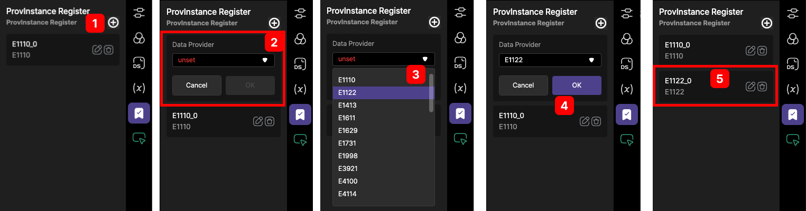

 
 

> &nbsp;
> 
> ProvInstance Register는  <참고1>의 스텝으로 진행이 가능합니다.
>
>  * <3번> Data Provider에 연동된 데이터 목록을 표시합니다.
>
> &nbsp;

 
 

<참고2>

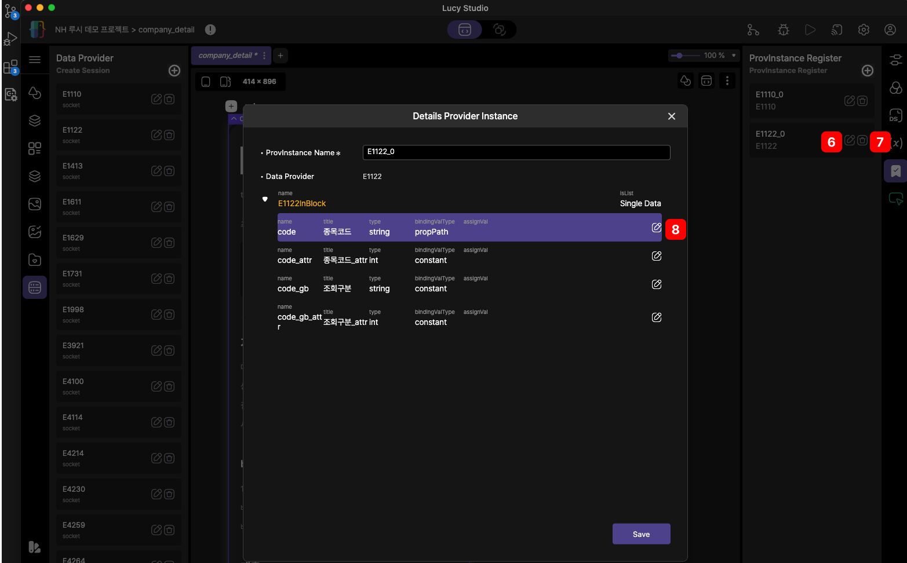

 
 

<참고3>

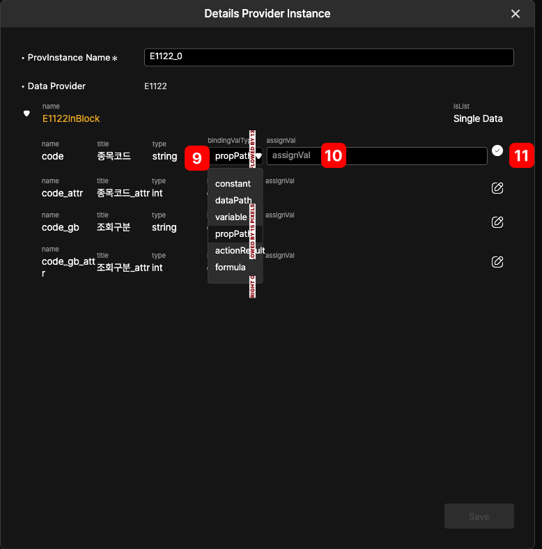

 
 

> &nbsp;
>  
> Detail ProvInstance 설정 변경 
>
> 
> 6.  수정
> 
>      Data Provider Instance 모달창이 표시됩니다.
>
> 7. 삭제
>
>     ProvInstance Register에 등록된 항목이 삭제됩니다.
>
> 8. 편집모드
>
>     <참고 3> 편집모드로 표시됩니다.  
>
> 9. bindingValType
> 
>    1. constant : 디폴트 값이 있으면 설정가능합니다.
>    2. dataPath : Data Source의 IO의 필드값을 AssignVal를 통해 통신이 가능하게 설정이 가능합니다.
>    3. variable : 추후 설명
>    4. propPath : 추후 설명
>    5. actionResult : 추후 설명
>    6. formula : 추후 설명
>
> &nbsp;
> 
> 10. assignVal
>
>     bindingValType에 따라서 설정가능한 값을 입력합니다.
>
> 11. 변경 내용 저장
>
>     bindingValType, assignVal의 설정값이 변경되면 변경사항을 저장합니다.
> 
> &nbsp;

 
 

### 6. Action
 
 

화면의 이동, 원격 데이터와의 통신, 변수설정, toast message등등 여러가지 기능을 제공합니다.

 

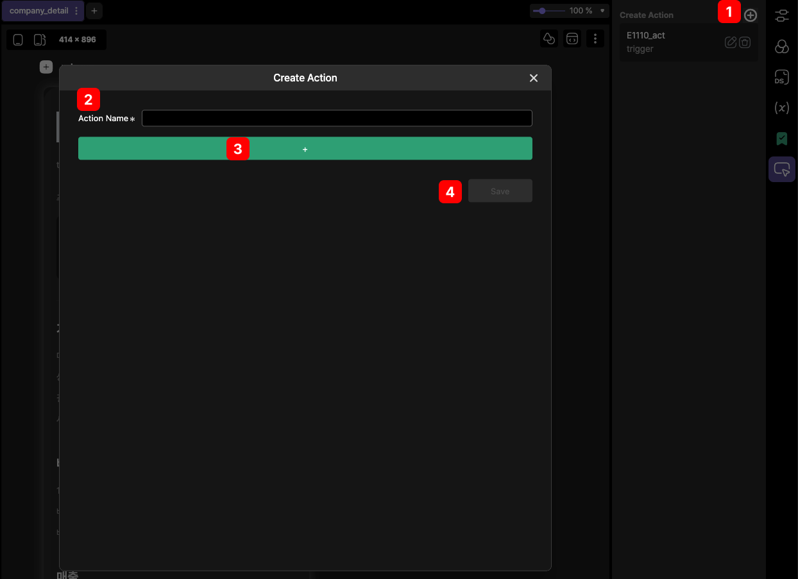

 

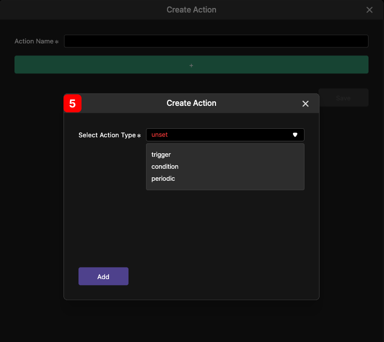

 

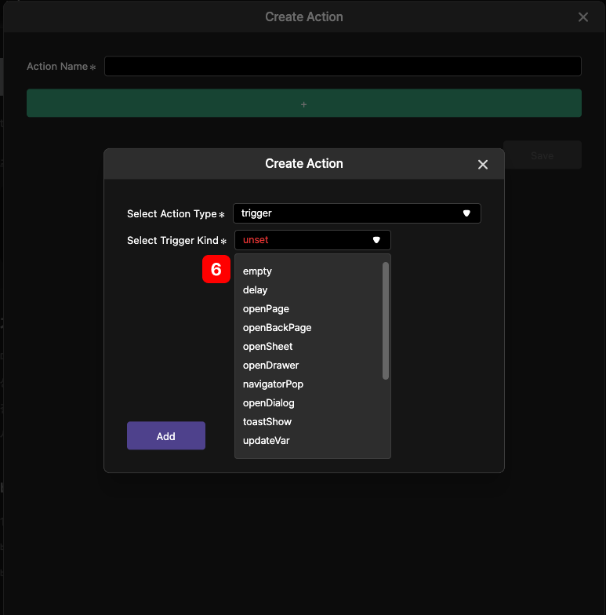

 

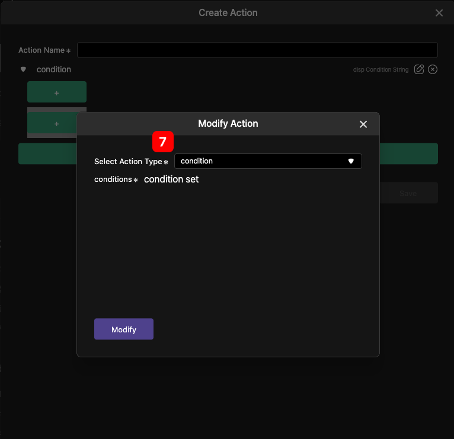

 

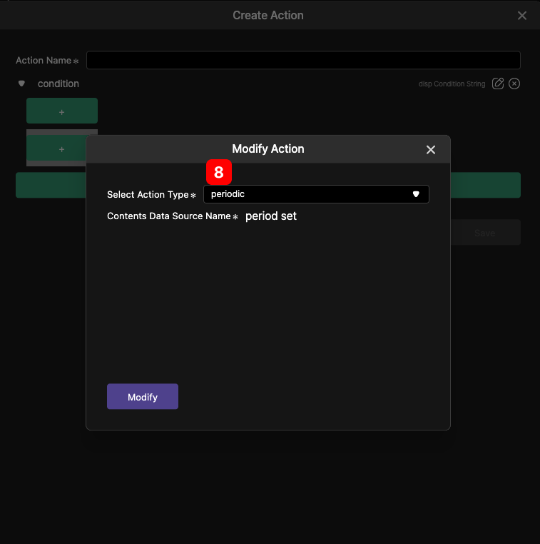

 

> &nbsp;
>  
> 1. create action
>
>    클릭하시면 추가할 action 팝업창이 생성됩니다.
>
> 2. Action Name
>
>    필수입력 사항으로 Action Name을 지정하셔야 됩니다.
>
> 3. Select Action Type
> 
>    클릭 시  <5번> 팝업창이 나오며 trigger, condition, periodic의 타입선택이 가능합니다.
>    
>    Select Action Type
>  
>        1. trigger : 면이동, 화면닫기, 팝업창, 변수 설정 등등 다양한 기능을 제공합니다.
> 
>        2. condition : 분기 조건설정 기능을 제공합니다.
> 
>        3. periodic : 추후 설명
> 
>
> 4. Save
>    
>    action name,type을 설정하고 저장하면 action이 추가됩니다.
> 
> 5. Action 추가 팝업
>
>    &nbsp;
>
> 6. Select Action Type(trigger 선택 시)
>     
>
>     1. empty
> 
>        추후 설명
> 
>     2. delay
>     
>         지연시간 설정이 가능합니다.
>
>      3. openPage
>       
>           이동할 페이지의 경로설정 및 애니메이션 기능을 제공합니다. 
>        
>      4. openBackPage
>
>           뒤로가기 기능을 제공합니다.
>
>      5. openSheet
>
>           아래에서 위로 올라오는 BottomSheet 페이지를 보여주는 기능입니다.
>
>      6. openDrawer
>
>           추후 설명
>
>      7. navigatorPop
>
>           현재 창을 닫습니다.
>
>      8. oppenDialog
>
>           추후 설명
>
>      9. toastShow
>
>           토스트 메세지를 보여줍니다.      
>
>      10. updateVar
>
>           추후 설명
>
>      11. clearVar
> 
>           추후 설명
>
>      12. exeEventResponse
>
>           추후 설명
>
>      13. requestData
>
>           Provider Instance Name을 지정해 주면 해당 Data Provider로 정보를 전송합니다.
>
>      14. subscribeData
> 
>           Provider Instance 선택시 해당 Data Provider로 실시간 데이터 연결해 줍니다.  
>
>      15. unsubscribeData
>
>           Provider Instance 선택시 해당 Data Provider로 실시간 데이터 연결을 해제합니다. 
>
>      16. loadFile
>
>           추후 설명  
> 
> 
> 7. Select Action Type(condition 선택 시)
> 
>      추후 설명
>
> 
> 8. Select Action Type(periodic 선택 시)
> 
> 
>     추후 설명
>
>  &nbsp;   

 
 

### 7. 접기/ 펼치기
 
 

panel tabbar 옵션창들을 접거나 펼칠 수 있습니다.

 