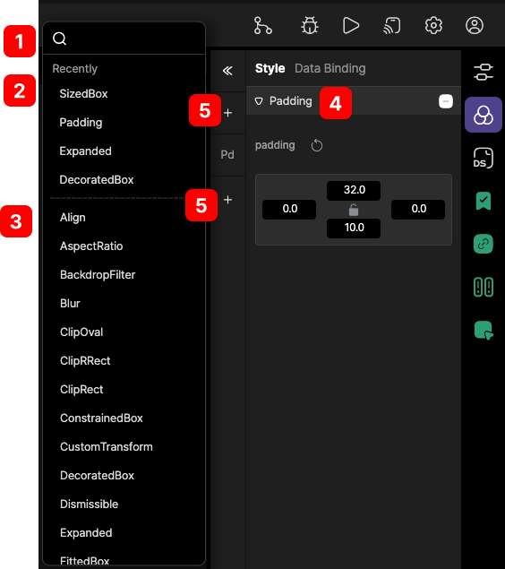

# panel tabbar

properties, Styles, Data Source, Provider Instance, CDS, Data Binding, Action 기능을 제공합니다.

 
 
 

### 1. Properties
 
   
   property는 선택된 위젯의 색상, 폰트크기 등 여러가지 옵션을 변경할 수 있습니다.

 

 
 
 

* Data Binding
    1. Provider를 통해서 연동 된 데이터셋을 Provider Instance로 생성합니다.
    2. 생성 된 Provider Instance를 CDS(Content Data Source)와 연동합니다.
    3. 연동 된 CDS와 위젯의 ID를 통해서 위젯의 값 또는 옵션 등의 연결을 지원합니다.  

 

 
 
 

### 2. Styles
 
 선텍된 위젯의 Property를 통해서 설정된 위젯의 여러 옵션 설정뿐만 아니라 wrap으로 

 

 

