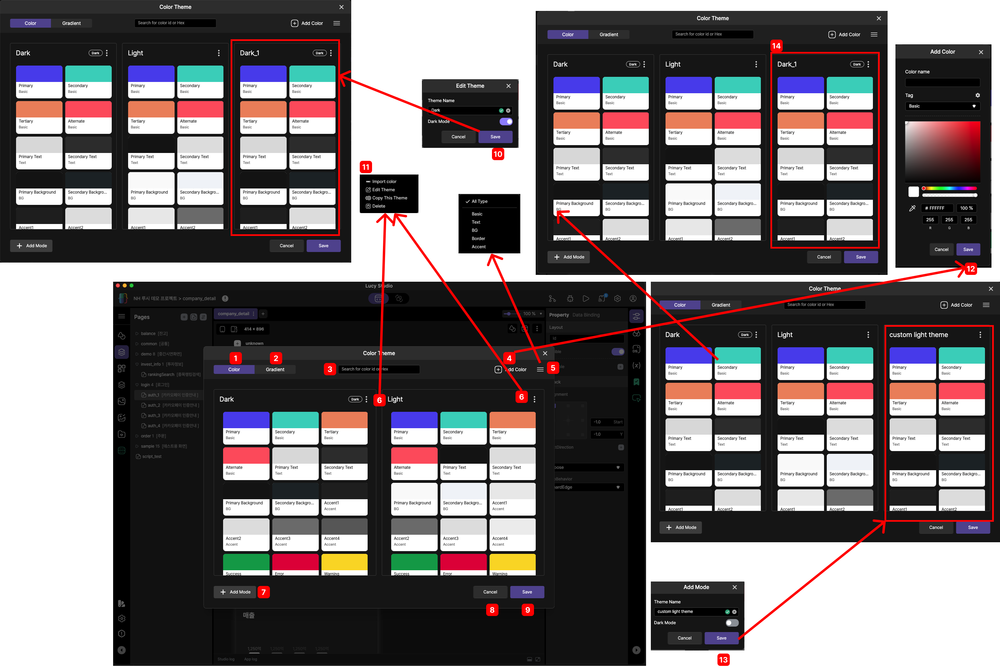

# plate tabbar

plate tabbar는 Lucy Studio 왼쪽에 있습니다.

Widgets, Pages 화면, Widgets tree, Components, Images, Assets Explorer, My Widgets, Data Provider, state transition 등등의 정보를 제공합니다.

 

 
 
 

### 1. main menu

메인메뉴항목입니다.

 
 
 

### 2. Widgets

Canvas Area에 위젯들의 배치가 가능하게 해 주는 도구모음입니다.

 
 
 

### 3. Pages

화면을 구성하는 widget들의 배치를 Tree 구조로 볼 수 있으며 Widget의 추가, 이동을 하실 수 있습니다.

 
 
 

### 4. Widget Tree

 참가하고 있는 프로젝트를 트리형식으로 폴더와 파일구조로 표시됩니다.

 
 
 

### 5. Component

추후 설명

 
 
 

### 6. Images

git 원격저장소 저장되어 있는 이미지 목록을 표시합니다.

 
 
 

### 7. Asset Explorer

추후 설명

 
 
 

### 8. My Widgets

추후 설명

 
 
 

 
### 9. Data Provider

구체적인 설정방법은 추후 설명합니다.

 
 
 

 
### 10. Theme 설정

default로 "Dark", "Light"기본 테마그룹이 존재하며 필요시 태마 추가,삭제가 가능합니다.

> &nbsp;
>
>  1. Color 
> 
>     테마 그룹을 보여줍니다.
> 
>  2. Gradient
> 
>     추후 설명
>
>  3. Search for color id or Hex
>
>     테마그룹의 제목 또는 Hex값으로 검색 가능합니다.
>
>  4. Add Color
>
>     <12번> 색상 추가 팝업이 나오며 이름과 Tag를 선택 후에 색상 추가시 테마그룹에 색상이 추가됩니다. 
> 
> 
> &nbsp;
> 
 
 
 

