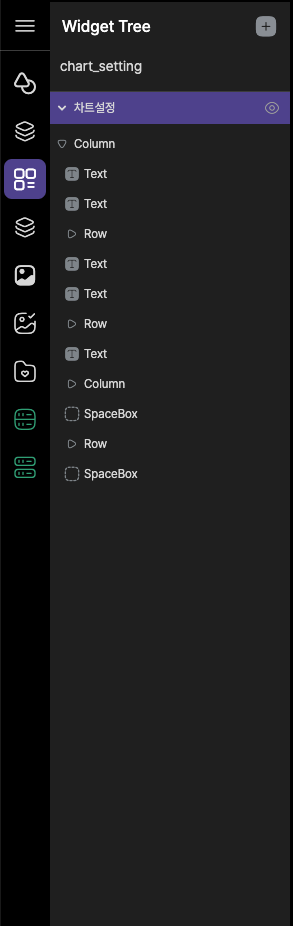

# plate tabbar

plate tabbar는 Lucy Studio 왼쪽에 있습니다.

Widgets, Pages 화면, Widgets tree, Components, Images, Assets Explorer, My Widgets, Data Provider, state transition 등등의 정보를 제공합니다.

 

 
 
 

### 1. main menu

메인메뉴항목입니다.

 
 
 

### 2. Widgets

Canvas Area에 위젯들의 배치가 가능하게 해 주는 도구모음입니다.

 
 
 

### 3. Widget Tree

화면을 구성하는 widget들의 배치를 Tree 구조로 볼 수 있으며 Widget의 추가, 이동을 하실 수 있습니다.

