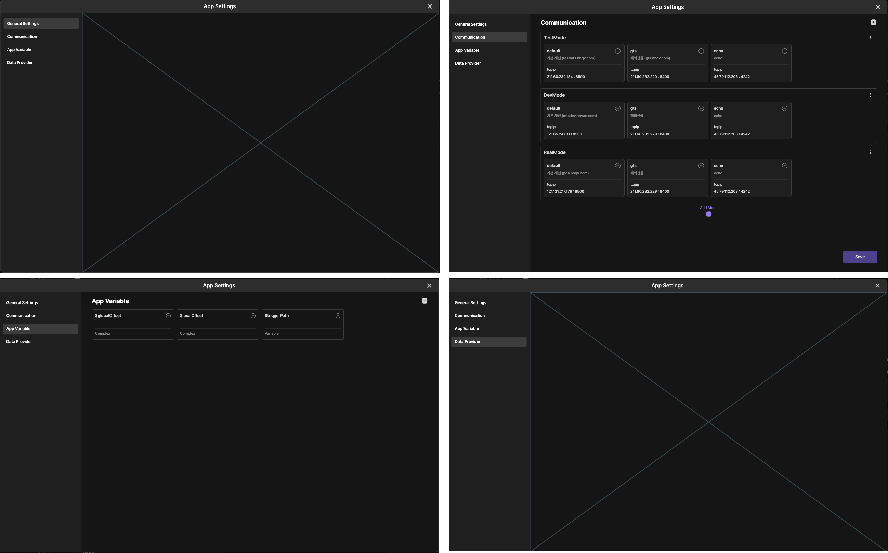

# plate tabbar

plate tabbar는 Lucy Studio 왼쪽에 있습니다.

Widgets, Pages 화면, Widgets tree, Components, Images, Assets Explorer, My Widgets, Data Provider, state transition 등등의 정보를 제공합니다.

 

 
 
 

### 1. main menu

메인메뉴항목입니다.

 
 
 

### 2. Widgets

Canvas Area에 위젯들의 배치가 가능하게 해 주는 도구모음입니다.

 
 
 

### 3. Pages

화면을 구성하는 widget들의 배치를 Tree 구조로 볼 수 있으며 Widget의 추가, 이동을 하실 수 있습니다.

 
 
 

### 4. Widget Tree

 참가하고 있는 프로젝트를 트리형식으로 폴더와 파일구조로 표시됩니다.

 
 
 

### 5. Component

추후 설명

 
 
 

### 6. Images

git 원격저장소 저장되어 있는 이미지 목록을 표시합니다.

 
 
 

### 7. Asset Explorer

추후 설명

 
 
 

### 8. My Widgets

추후 설명

 
 
 

 
### 9. Data Provider

구체적인 설정방법은 추후 설명이 필요합니다.

 
 

>&nbsp;
>  
> Call Definition(input값 설정)
> 
>   1. Group 추가
>
>   2. Field 추가
>
> Response Definition(output 설정)
> 
>   3. Group 추가
>
>   4. Field 추가
>
>   
> 
> &nbsp;

 
 

 
 

>&nbsp;
> 
> 
> 1. Provider Type 선택
>
> 2. 데이터 타입 체크
>
> 
> 3. Select Channel 선택
>
>
> 4. Header Type 선택
>
>
> 5. Select Channel 선택
>   
>
>
> 6. Format Type 선택
>   
>
>   
> 
> &nbsp;

 
 

 
### 10. Theme 설정

default로 "Dark", "Light"기본 테마그룹이 존재하며 필요시 태마 추가,삭제가 가능합니다.

> &nbsp;
>
>  1. Color 
> 
>     테마 그룹을 보여줍니다.
> 
>  2. Gradient
> 
>     추후 설명
>
>  3. Search for color id or Hex
>
>     테마그룹의 제목 또는 헥사값으로 검색 가능합니다.
>
>  4. Add Color
>
>     <12번> 색상 추가 팝업이 나오며 이름과 Tag를 선택 후에 색상 추가시 테마그룹에 색상이 추가됩니다. 
> 
>  5. Theme 그룹 분류별로 보기
>
>     테마그룹을 필요하신 분류별로 선택해서 색상코드를 보실 수 있습니다. 
> 
>  6. 선택 테마의 관리
>
>     <11번> 참조
>   
>     1. Import color 
>
>        추후 설명
>
>     2. Edit Theme
>
>        <10반> 팝업에서 테마명, Dart Mode 여부 선택 후 "저장"하시면 테마 그룹이 추가됩니다.
> 
>     3. Copy This Theme
>
>        현재 선택된 테마그룹을 복사합니다.
> 
>     4. Delete
>
>        현재 선택된 테마그룹을 삭제합니다.
> 
>  7. Add Mode
>
>     <13번> 참조
>
>     테마명과 Dark Mode 여부를 선택하고 저장하시면 실시간으로 테마그룹이 추가됩니다.
> 
>  8. Close
>
>     현재 열린 팝업창을 닫습니다. 
> 
>  9. Save
>
>     테마그룹 추가, 삭제, 복사 후에 전체 내용을 저장합니다. 
> 
>  10. Edit Theme 팝업
>
>      <11번> 메뉴 > Edit Theme 실행 후에 테마명, Dark Mode여부를 선택하고 "저장"하시면 테마가 변경됩니다. 
> 
>  11. 테마 선택 메뉴
>
>
>  12. Add Color 팝업
>
>   
>  13. Add Mode 팝업
>
> 
> 
> &nbsp;
>

 
 
 

 
### 11. App Setting

추후 설명

 
 
 

### 12. 
 
 

추후 설명

 
 
 

### 13. 접기/ 펼치기
 
 

plate tabbar 옵션창 목록을 접거나 펼칠 수 있습니다.

