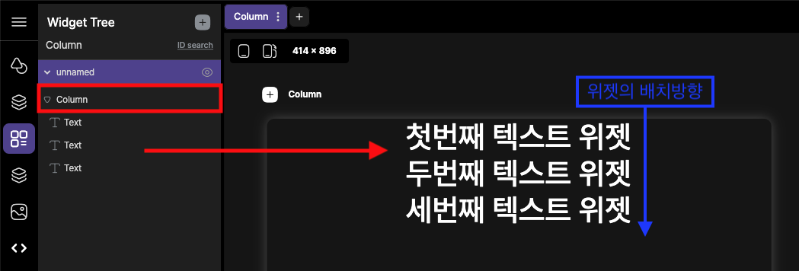
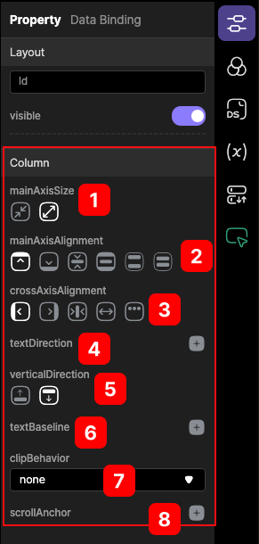

# Column 

 Column 위젯 은 세로 레이아웃을 만드는 데 사용됩니다. 가장 많이 사용되는 위젯 중 하나입니다.

  

Column 위젯 내부의 하위요소는 수직 방향으로 배열됩니다. 
기본적으로 Column 내부의 모든 하위 요소는 수직 방식으로 배열됩니다.

    

Row 위젯과의 차이는 다음과 같습니다.

     

## Customizing

기본속성값을 사용하여 열 위젯의 동작을 사용자가 정의할 수 있습니다.

### @ mainAxisSize
주 축 크기는 열이 주 축(즉, 수직 방향)에서 차지하는 공간의 양을 정의합니다.
  

1. 최소한의 크기를 차지하도록 합니다. column 크기를 내부 하위항목의 전체 크기와 동일하게 채웁니다.
2. 최대한의 크기를 차지하도록 합니다. 사용 가능한 모든 공간을 채웁니다.
   
### @ mainAxisAlignment
child 위젯을 배치하는 간격을 설정합니다.
 

1. 시작점에서 부터 모든 하위항목을 배치합니다.(start)
2. 종료지점에서 부터 모든 하위항목을 배치합니다.(end)
3. 가운데로 모든 하위항목을 배치합니다.(center)
4. 처음부터 마지막까지 위젯의 위치를 균등하게 배치합니다. (spaceBetween)
5. child 위젯간의 공간을 두고, 절반 크기만큼 양 옆에 공간을 배치합니다. (spaceAround)
6. 위젯간의 공간을 두고, 같은 크기만큼 양옆의 공간을 배치합니다.(spaceEvenly)

### @ crossAxisAlignment
child 위젯의 시작지점을 설정합니다.
 

1. 오른쪽으로 모든 하위항목을 배치합니다.
2. 왼쪽으로 모든 하위항목을 배치합니다.
3. 가운데로 모든 하위항목을 배치합니다.
4. 하위 항목의 최대한의 사이즈로 늘립니다.(stretch)
5. 베이스라인은 서로 다른 위젯, 폰트의 기준을 잡아주는 역할을 한다 (baseline)
   
### @ textDirection
column 위젯내의 텍스트 방향을 설정합니다.
 

1. 오른쪽에서 왼쪽으로 순서대로 배치한다.
2. 왼쪽에서 오른쪽으로 순서대로 배치한다.
   
### @ verticalDirection
child 위젯의 쌓는 기준을 설정합니다. 
 

1. 아래에서 위로 위젯을 쌓는다.
2. 위에서 아래로 위젯을 쌓는다.(기본)

### @ textBaseline
텍스트의 기본선을 설정합니다. 
 

1. 알파뱃기준선으로 (alphabetic)
2. ideographic
   

### @ chipBehavior
공간을 확보하는 위젯의 하위 자식위젯의 이미지등을 오려내서 표현하는 방법이다. 이때는 오려내는 방법을 의미한다.
 
1. 콘텐츠를 자를 필요 없을 경우 (none)
2. 원이나 직선이 계단형태로 표시.(hardEdge)
3. 콘텐츠의 이미지 등의 계단현상을 방지하는 형태(antiAlias)
4. 콘텐츠의 이미지 등의 계단현상을 방지하는 형태, 게다가 느리다.(antiAliasWithSaveLayer)

[Clip 참조] https://api.flutter.dev/flutter/dart-ui/Clip.html

### @ scrollAnchor
해당 컬럼내에 스크롤앵커를 사용하기위해 설정합니다.(추가 첨부) 

