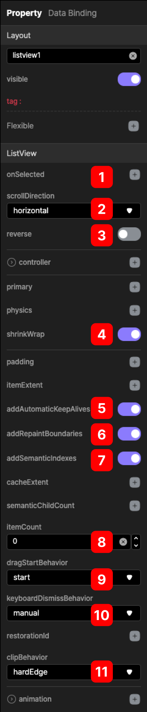
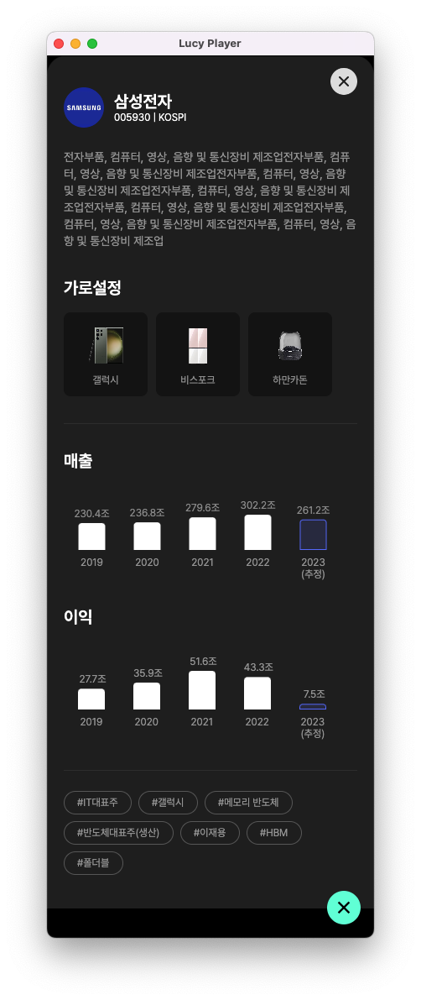
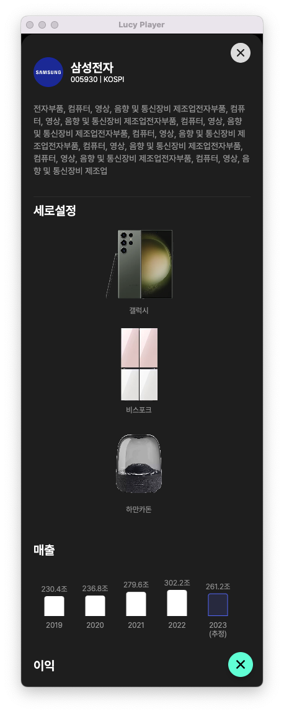
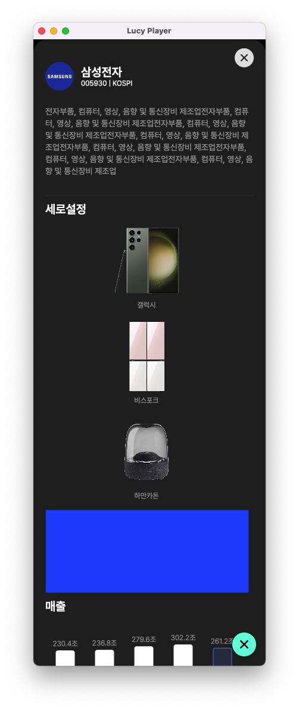
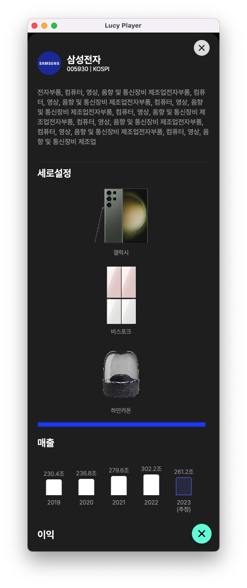

# ListView
ListView 위젯은 목록을 선형 배열(수평 또는 수직)로 표시하는데 유용한 위젯입니다.
 
게다가 자동으로 스크롤 기능을 제공하는 column 위젯의 고급 버전입니다.
 
ListView 위젯은 많은 양의 데이터를 관리하기 위해서 시각적으로 매력적이고 실용적인 방식으로 데이터 목록을 효율적으로 표시하는 방법을 제공합니다. 
  정적데이터 및 동적데이터 둘 다를 지원합니다.
  

## Customizing

  

### @ onSelected
목록을 선택시에 발생할 Action 을 선택할 수 있습니다.

### @ scrollDirection
목록이 배치되는 방향을 결정합니다. 
1. horizontal (가로설정)
2. vertical (세로설정)

  

### @ reverse
선택시 내부에 목록이 배치될 순서가 뒤집혀 보여집니다.
 
가로 설정인 경우 왼쪽 -> 오른쪽에서 오른쪽 -> 왼쪽 방향으로 위젯이 배치됩니다.
 

### @ shrinkWrap
기본적으로 ListView 위젯은 주축에서 사용가능한 공간을 모두 차지합니다. 설정이 Vertical 인 경우 ListView는 화면의 모든 수직공간을 차지합니다.  
ListView가 하위 항목의 크기만 사용하도록 하려면 이 옵션을 활성화합니다. 

아래 이미지의 파란색 영역은 빈공간입니다. 이 기능을 활성화되면 다음과 같이 빈공간이 줄어들게 됩니다.

  

### @ addAutomaticKeepAlives
이미지가 ListView 내부에 있을때 최초에 이미지 렌더링이 되고 끝난뒤에 더 많은 이미지들이 아래에서 보여지게 되면 먼저 보여졌던 
 
이미지들은 제거 되었다가 다시 화면에 보여집니다. 이때 다시 이미지를 렌더링 하게됩니다. 이를 방지하는 것으로
 
기본적으로 true 상태로 사용합니다.

### @ addRepaintBoundaries
위젯의 컨텐츠를 업데이트 해야하는 경우 다시 그리기를 수행합니다. 하지만 콘텐츠가 변경되지 않은 다른 위젯을 
 
다시 그릴수도 있습니다. 이는 성능의 영향을 미칩니다. 변경되지 않은 콘텐츠를 다시 그리지 않게 설정하는 기능입니다.
 
기본적으로 true 상태로 사용합니다.

### @ addSemanticIndexes
IndexedSemantics 에서 각 하위 항목을 래핑할지 여부입니다.
 
일반적으로 올바른 접근성 알림을 생성하려면 스크롤 컨테이너의 하위 항목에 의미 색인으로 주석을 달아야 합니다. 
 
IndexedSemantics 위젯 에서 인덱스를 이미 제공한 경우에만 false로 설정해야 합니다 .
 
기본값은 true입니다.

### @ itemCount
ListView 위젯내의 목록의 갯수를 정합니다. 0으로 설정하면 동적으로 처리가 가능합니다.
 
[ListView 위젯에 파일정보를 읽어 동적으로 등록하는 과정](/simple_app/LoadFile.md)

 

### @ dragStartBehavior
드래그 시작 동작이 처리되는 방식을 결정합니다.

 
DragStartBehavior.start 로 설정하면 드래그 동작이 경기장에서 승리한 위치에서 스크롤 드래그 동작이 시작됩니다. 
 
DragStartBehavior.down 으로 설정하면 다운 이벤트가 처음 감지된 위치에서 시작됩니다.

 
일반적으로 이것을 DragStartBehavior.start 로 설정하면 드래그 애니메이션이 더 부드러워지고 DragStartBehavior.down 으로 설정하면 드래그 동작이 약간 더 반응적으로 느껴집니다.
 
기본적으로 끌기 시작 동작은 DragStartBehavior.start 입니다.
 

### @ keyboardDismissBehavior
keyboardDissmissBehavior: 말 그대로 키보드 제거 동작인데 ScrollViewKeyBoardDissmissBehavior라는 enum 타입을 사용한다.

- ScrollViewKeyboardDissmissBehavior.onDrag: 드래그를 하면 키보드가 내려감
- ScrollViewKeyboardDissmissBehavior.manual: 매뉴얼대로 키보드의 "완료" 버튼을 누르면 내려감

 

### @ chipBehavior
공간을 확보하는 위젯의 하위 자식위젯의 이미지등을 오려내서 표현하는 방법입니다. 이때 오려내는 방법을 의미합니다.
 
1. 콘텐츠를 자를 필요 없을 경우 (none)
2. 원이나 직선이 계단형태로 표시(hardEdge)
3. 콘텐츠의 이미지 등의 계단현상을 방지하는 형태(antiAlias)
4. 콘텐츠의 이미지 등의 계단현상을 방지하는 형태, 가장 느립니다.(antiAliasWithSaveLayer)
 

[Clip 참조] https://api.flutter.dev/flutter/dart-ui/Clip.html

  
  
  
  

