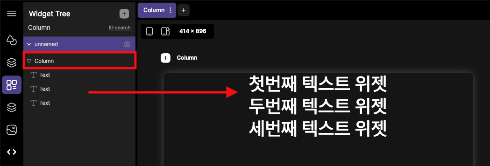
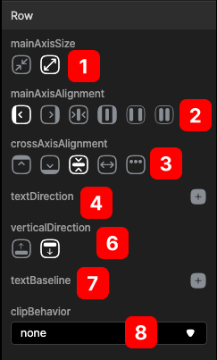

# Column 

 Row 위젯 은 가로로 레이아웃을 만드는 데 사용됩니다. 가장 많이 사용되는 위젯 중 하나입니다.

  

Row 위젯 내부의 하위요소는 수평 방향으로 배열됩니다. 
기본적으로 Row 내부의 모든 하위 요소는 수평 방식으로 배열됩니다. 

    

Column 위젯과의 차이는 다음과 같습니다(수직방향)

     

## Customizing

기본속성값을 사용하여 열 위젯의 동작을 사용자가 정의할 수 있습니다.

### @ mainAxisSize
주 축 크기는 열이 주 축(즉, 수평 방향:Column과는 다름)에서 차지하는 공간의 양을 정의합니다.
  

1. 최소한의 크기를 차지하도록 합니다. column 크기를 내부 하위항목의 전체 크기와 동일하게 채웁니다.
2. 최대한의 크기를 차지하도록 합니다. 사용 가능한 모든 공간을 채웁니다.
   
### @ mainAxisAlignment
child 위젯을 배치하는 간격을 설정합니다.
 

1. 왼쪽으로 모든 하위항목을 배치합니다.
2. 오른쪽으로 모든 하위항목을 배치합니다.
3. 가운데로 모든 하위항목을 배치합니다.
4. 처음부터 마지막까지 위젯의 위치를 균등하게 배치합니다. (spaceBetween)
5. child 위젯간의 공간을 두고, 절반 크기만큼 양 옆에 공간을 둔다. (spaceAround)
6. 위젯간의 공간을 두고, 같은 크기만큼 양옆의 공간을 둔다.(spaceEvenly)

### @ crossAxisAlignment
child 위젯의 시작지점을 설정합니다.
 

1. 윗쪽으로 모든 하위항목을 배치합니다.
2. 오른쪽으로 모든 하위항목을 배치합니다.
3. 가운데로 모든 하위항목을 배치합니다.
4. 하위 항목의 최대한의 사이즈로 늘립니다.(stretch)
5. 베이스라인은 서로 다른 위젯, 폰트의 기준을 잡아주는 역할을 한다 (baseline:에러남)
   
### @ textDirection
Row 위젯내의 텍스트 방향을 설정합니다.
 

1. 오른쪽에서 왼쪽으로 순서대로 배치한다.
2. 왼쪽에서 오른쪽으로 순서대로 배치한다.
   
### @ verticalDirection
child 위젯의 쌓는 기준을 설정합니다. 
 

1. 아래에서 위로 위젯을 쌓는다.
2. 위에서 아래로 위젯을 쌓는다.(기본)

### @ textBaseline
텍스트의 기본선을 설정합니다. 
 

1. 알파뱃기준선으로 (alphabetic)
2. ideographic
   

### @ clipBehavior
 

1. none
2. hardEdge
3. antiAlias
4. antiAliasWithSaveLayer

