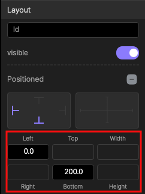

# Stack
Stack 위젯은 하위 위젯이 서로 겹쳐질 수 있습니다. 스택의 마지막 자식이 맨위에 유지됩니다.
 
이미지 위에 텍스트를 표시하거나 다른 이미지 2개를 서로 겹치는 등의 동작을 합니다. 
 
    
아래의 예시는 stack 을 이해하는데 도움이 됩니다.

 
예시는 stack 내에 image, text 를 배치한 예시입니다.

 

column 내에 image, text 를 배치한 예시입니다.
 

스택은 수치를 이용하여 원하는 위치에 배치할수 있습니다.

    

## Customizing
 

### @ alignment
 

스택의 하위의 위젯에 위치 시작값을 설정한한다. 백분율 기준으로 수치를 변경합니다. 100% = 1.0 으로 결정합니다. 
 
두가지 방법으로 해당 설정값을 조정합니다. 

### @ textDirection
 
하위 위젯의 시작을 결정합니다.
 

1. 오른쪽에서 왼쪽으로 순서대로 배치한다.
2. 왼쪽에서 오른쪽으로 순서대로 배치한다.
   
### @ fit
 
1. 가능한만큼 늘어남 (tight)
2. 필요한만큼만 늘어남 (loose)

### @ chipBehavior
공간을 확보하는 위젯의 하위 자식위젯의 이미지등을 오려내서 표현하는 방법이다. 이때는 오려내는 방법을 의미한다.
 
1. 콘텐츠를 자를 필요 없을 경우 (none)
2. 원이나 직선이 계단형태로 표시.(hardEdge)
3. 콘텐츠의 이미지 등의 계단현상을 방지하는 형태(antiAlias)
4. 콘텐츠의 이미지 등의 계단현상을 방지하는 형태, 게다가 느리다.(antiAliasWithSaveLayer)

[Clip 참조] https://api.flutter.dev/flutter/dart-ui/Clip.html

 

## Stack 하위의 위젯 설정
Stack 위젯을 배치한후 그 child 위젯으로

1. 이미지 위젯을 추가합니다.(파란색 예시)
2. 텍스트 위젯을 추가합니다.(빨간색 예시))

- 텍스트 위젯은 아래의 설정 1)처럼 Left:0 , Bottom:200 을 설정한다면 
- x축으로 왼쪽에서 오른쪽으로 0만큼 아래에서 위로 200만큼 위치에 해당 텍스트 위젯을 배치합니다.
- 이미지 위젯은 아래의 설정 2)처럼 Left:80  으로 설정한다면
- x축으로 왼쪽에서 오른쪽으로 80만큼의 위치에 해당 이미지 위젯을 배치합니다.
- Left와 Right는 동시에 사용할수 없습니다. 마찬가지로 Top, Bottom은 동시에 사용할수 없습니다. 
- Width, Height는 Size와 유사합니다. 

 
 

 

설정1  &nbsp;&nbsp;&nbsp;&nbsp;&nbsp;&nbsp;&nbsp;&nbsp;&nbsp;&nbsp;&nbsp;&nbsp;&nbsp;&nbsp;&nbsp;&nbsp;&nbsp;&nbsp;&nbsp;&nbsp;&nbsp;&nbsp;&nbsp;&nbsp;&nbsp;&nbsp;&nbsp;&nbsp;&nbsp;&nbsp;&nbsp;&nbsp;&nbsp;&nbsp;&nbsp;&nbsp;&nbsp;&nbsp;&nbsp;&nbsp;&nbsp;&nbsp;&nbsp;&nbsp;&nbsp;&nbsp;&nbsp;&nbsp;&nbsp;&nbsp;&nbsp;&nbsp;&nbsp;&nbsp;&nbsp;&nbsp;
설정2)

 

## 프로젝트에 스택 추가
