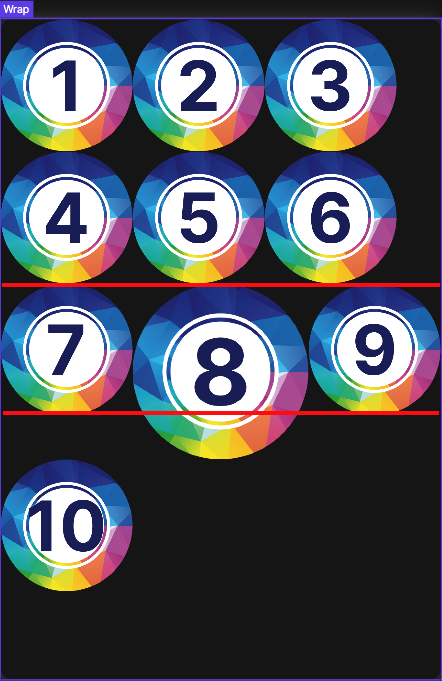

# Wrap
wrap 위젯은 하위 위젯을 차례로 표시합니다. 이런점에서 Row, Column과 유사합니다. 차이점은 하위 위젯을 표시할 공간이 부족하면
새로운 행이나 열에 배치합니다.
 
 
wrap 위젯은 해당 위젯의 영역내에서 하위 위젯이 배치될때 공간이 부족하면 column, row 위젯처럼 한방향으로
배치되며, 범위를 넘어서는 위젯이 있으면 다음라인으로 위치가 변경됩니다. 이때 설정한 방향(direction)에 따라서 배치되는 위치가 달라집니다. 

## Customizing

      

### @ direction
 
wrap 위젯의 진행방향을 설정합니다. 가로/세로방향의 설정값의 예시입니다.  
 

1. horizontal (가로방향)
2. vertical (세로방향)
  

#### 가로설정(horizontal)

  

#### 세로설정(vertical)

    

### @ alignment
 
wrap 하위 위젯의 줄맞춤을 결정합니다. spacing 설정과 연결됩니다.
 

1. 시작점에서 부터 모든 하위항목을 배치합니다.(start)
2. 종료지점에서 부터 모든 하위항목을 배치합니다.(end)
3. 가운데로 모든 하위항목을 배치합니다.(center)
4. 처음부터 마지막까지 위젯의 위치를 균등하게 배치합니다. (spaceBetween)
5. child 위젯간의 공간을 두고, 절반 크기만큼 양 옆에 공간을 배치합니다. (spaceAround)
6. 위젯간의 공간을 두고, 같은 크기만큼 양옆의 공간을 배치합니다.(spaceEvenly)

 <end 설정>

 

 <spaceBetween 설정>

 <spaceAround 설정>

 <spaceEvenly 설정>
   

### @ spacing
진행방향으로의 위젯간의 간격을 설정합니다.
 
alignment 설정방향으로 간격이 설정됩니다. 

   

### @ runAlignment
 
진행방향이 아닌 방향 (horizontal 인 경우 수직방향) 으로의 정렬을 설정합니다. (위의 사진을 참조)

1. 시작점에서 부터 모든 하위항목을 배치합니다.(start)
2. 종료지점에서 부터 모든 하위항목을 배치합니다.(end)
3. 가운데로 모든 하위항목을 배치합니다.(center)
4. 처음부터 마지막까지 위젯의 위치를 균등하게 배치합니다. (spaceBetween)
5. child 위젯간의 공간을 두고, 절반 크기만큼 양 옆에 공간을 배치합니다. (spaceAround)
6. 위젯간의 공간을 두고, 같은 크기만큼 양옆의 공간을 배치합니다.(spaceEvenly)

   

### @ runSpacing
 
진행방향이 아닌 수직 방향 (horizontal 인 경우 vertical) 으로의 간격을 설정합니다. 
  runAlignment 설정방향으로 간격이 설정됩니다. 

   

### @ crossAxisAlignment
 
높이가 다른 위젯들이 wrap 안에 있을때 해당 위젯의 높낮이 위치를 설정합니다.

1. start
2. end
3. center

 <start 설정>
 <end 설정>
 

   

### @ textDirection
 
하위 위젯의 시작지점을 결정합니다.
 

1. 오른쪽에서 왼쪽으로 순서대로 배치한다.
2. 왼쪽에서 오른쪽으로 순서대로 배치한다.

 <right-left + down 설정>

   
   

### @ verticalDirection
하위 위젯의 시작지점을 결정합니다.
 
1. up
2. down

 <left-right + up 설정>

   

### @ chipBehavior
공간을 확보하는 위젯의 하위 자식위젯의 이미지등을 오려내서 표현하는 방법이다. 이때는 오려내는 방법을 의미한다.
 
1. 콘텐츠를 자를 필요 없을 경우 (none)
2. 원이나 직선이 계단형태로 표시.(hardEdge)
3. 콘텐츠의 이미지 등의 계단현상을 방지하는 형태(antiAlias)
4. 콘텐츠의 이미지 등의 계단현상을 방지하는 형태, 게다가 느리다.(antiAliasWithSaveLayer)

[Clip 참조] https://api.flutter.dev/flutter/dart-ui/Clip.html