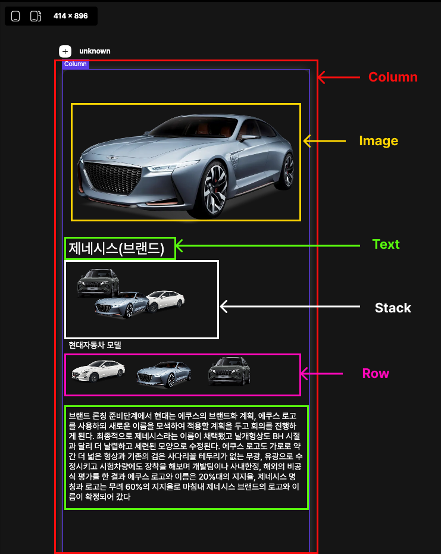
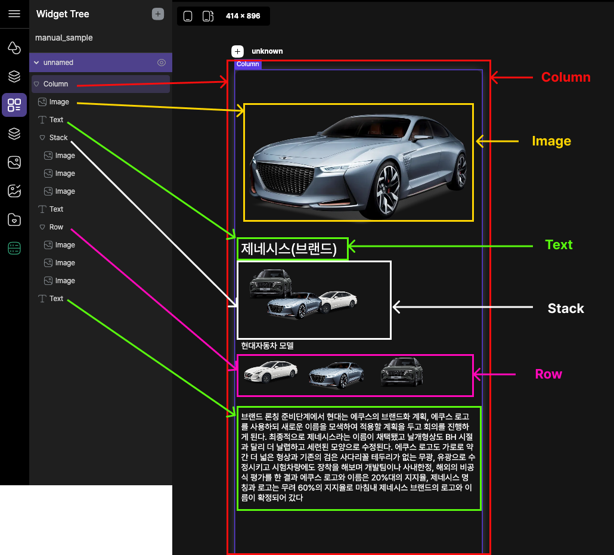

# Widgets

위젯은 앱의 사용자 인터페이스를 만드는 데 필수적입니다.

간단한 위젯분류, 사용방법을 대해서 설명하겠습니다.

 

### 위젯이란?

Lucy Studio에서 위젯은 화면 레이아웃을 구성하는 데 사용되는 디자인 UI의 요소입니다.

Everything is a Widget의 표현과 같이

화면에 표시되는 모든 것은 위젯으로 구성이 가능하게 Widget Tree의 계층화를 지원합니다.
(부모,자식 관계로 결합하여 위젯의 UI를 구성합니다.)

아래 그림은 Column, Image, Text, Stack, Row 위젯을 사용해서 구성한 화면입니다.

 

 
 
 

### 위젯 트리

위젯과 함께 배치하거나 다른 위젯 안에 배치하면 "Widget Tree"의 화면이 보여집니다.

화면 왼쪽의 배치한 위젯이 트리형태로 연결된 모습이 보여지며 트리 구조를 통해 부모, 자식간의 관계를 보여줍니다.

이를 통해 실시간으로 시각적으로 레이아웃 배치하는 것을 이해하는 데 도움이 됩니다.

 

