# LoadFile Action 만들기
파일을 읽어서 ListView 에 데이터를 넣는 샘플을 작성합니다.

먼저 파일을 만듭니다.

샘플데이터 : `jongmok.json` 의 구조 및 데이터 
 

1. 아래 텍스트를 복사합니다.
2. 파일명을 `jongmok.json` 으로 만듭니다.
3. jongmok.json 저장경로를 LUCY 설치 폴터의 data 에 저장합니다.

 
 

>{
    "outBlock0" :
    [
        {
            "title" : "ROTI",
            "name" : "Nippon Indosari Tbk",
            "price" : "8600",
            "gap" : "+50",
            "rate" : "+3.23%"
        },
        {
            "title" : "GOTO",
            "name" : "GoTo Gojek Tokopedia",
            "price" : "2421",
            "gap" : "-121",
            "rate" : "-20.6%"
        },
        {
            "title" : "ABNB",
            "name" : "Airbnb Inc",
            "price" : "5300",
            "gap" : "+31",
            "rate" : "+2.23%"
        },
        {
            "title" : "UNVR",
            "name" : "Unilever Indonesia",
            "price" : "3867",
            "gap" : "-71",
            "rate" : "-41.1%"
        }
    ]
}

  
data 폴더는 2023.12.20일 기준으로는 사용자가 새로 만들어야 합니다  
 ../assets/data 폴더안에 “jongmok.json” 파일을 존재해야(혹은 저장되어 있어야)합니다.

   
  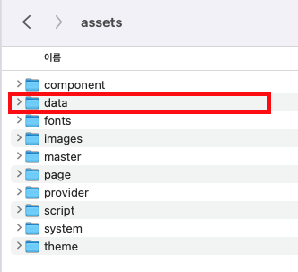
         

-----

 
 
 
먼저 DataProvider를 생성합니다. Call Definition 영역에서  
이름은 "jongmok", "custom", "json" 타입으로 설정합니다.
 
   
  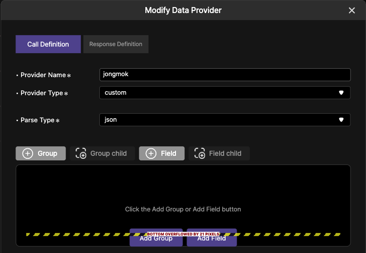
   

 
 
 
Response Definition 영역에서는 Json 파일의 형태처럼 만듦니다.
 
예시파일처럼 outBlock0을 그ㅂ으로 생성하고 하위에 필드 5개를 추가합니다.
 
   
  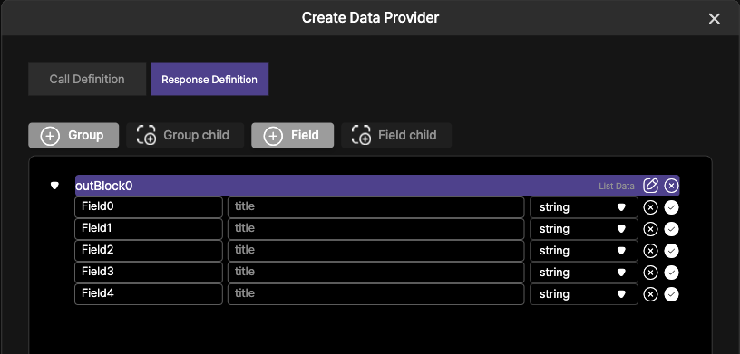
   

   
   
   
Json 파일의 필드의 이름과 동일하게 구성합니다.  
"title", "name", "price", "gap", "rate" 추가합니다.  
 
   
  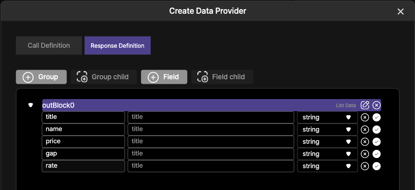
   

   
   
   
Data Provider 가 완성 되었습니다.    

   
  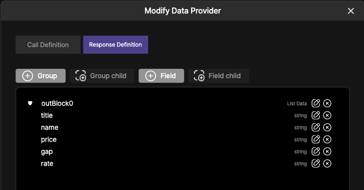
   
     

-----
 
 
 
 
1. ProviderInstance 등록과정 입니다.

  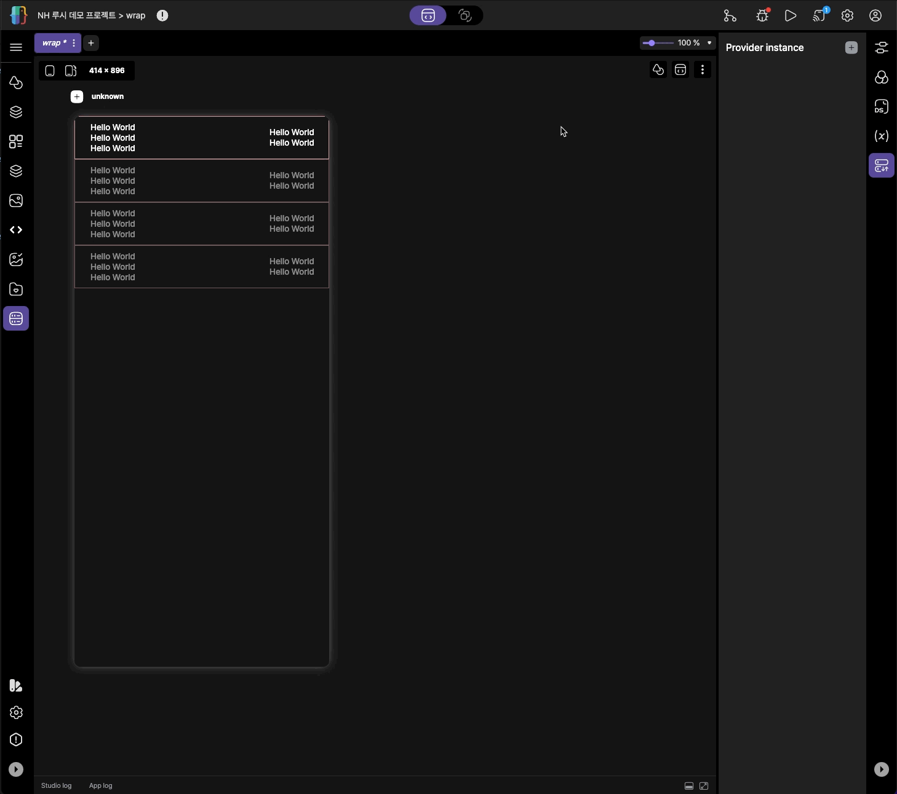
   
   

-----

 
 
 
 
2. 만들어진 PI 정보를 읽어와서 생성하는 과정입니다. 수동으로 작업해도 상관없습니다. 
    Data Source와 ProvInstance 와의 연결(전) 까지를 보여줍니다. 
  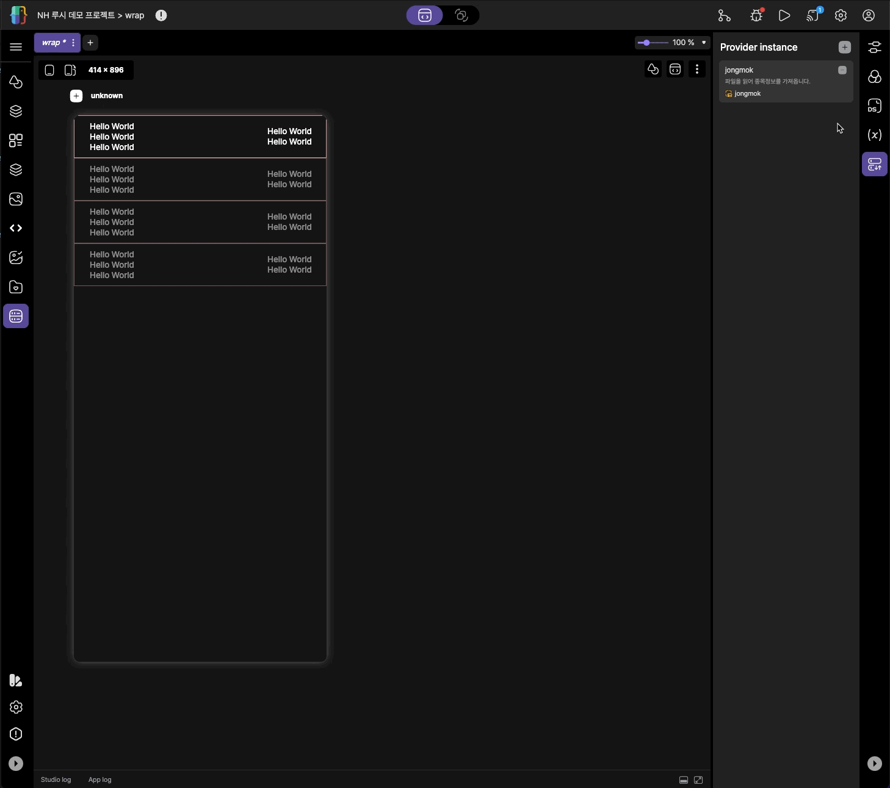
   
   

-----

 
 
 
 
3. Data Source와 ProvInstance 와의 연결(후) 입니다.
 
중요한점은 "outBlock0" 까지 연결을 반드시 해야합니다.  
  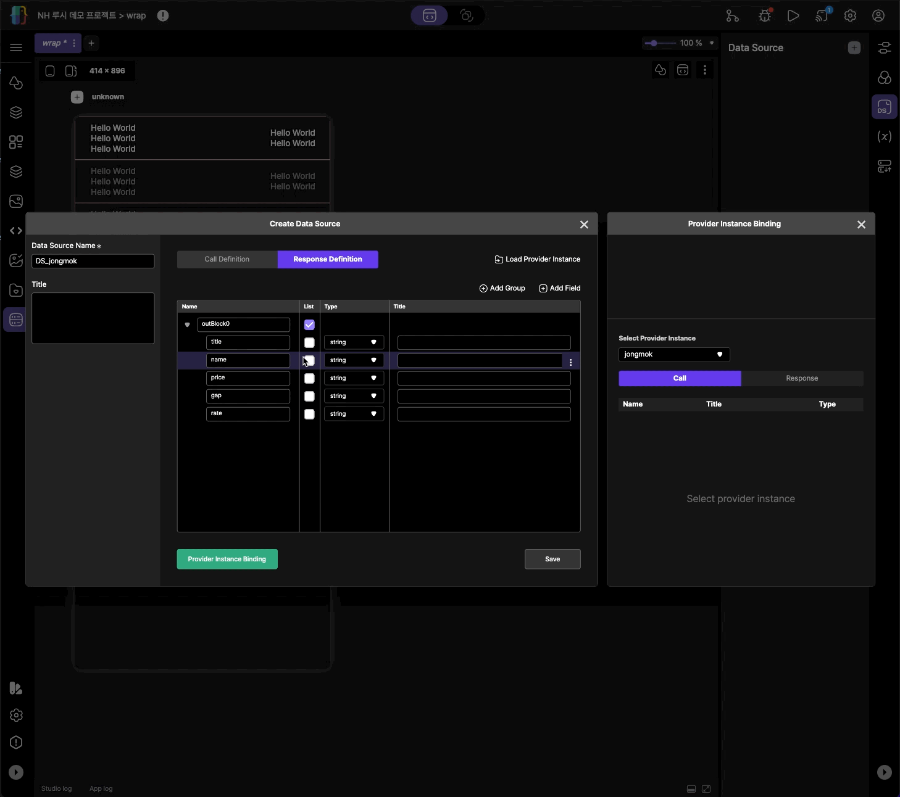
   
   

-----

 
 
 
 
4. 화면에 보여질 위젯과 DS와의 연결을 완료하는 과정입니다.
  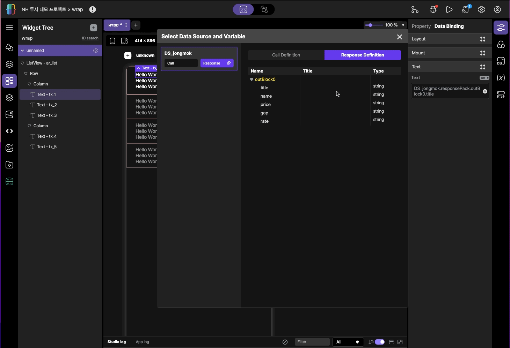
   
   

-----

 
 
 
 
5. 위젯의 ListVuew 와 DS의 outBlock까지 반드시 연결해야합니다.
  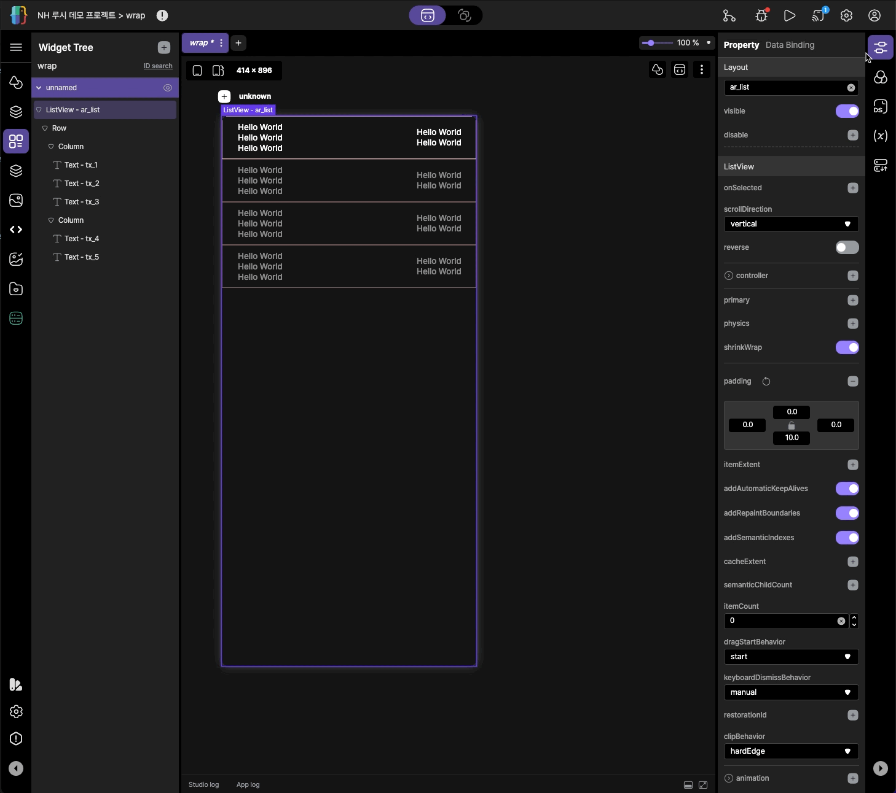
   
   

-----

 
 
 
 
6. StateTransition에 액션과정을 등록합니다.  
   
  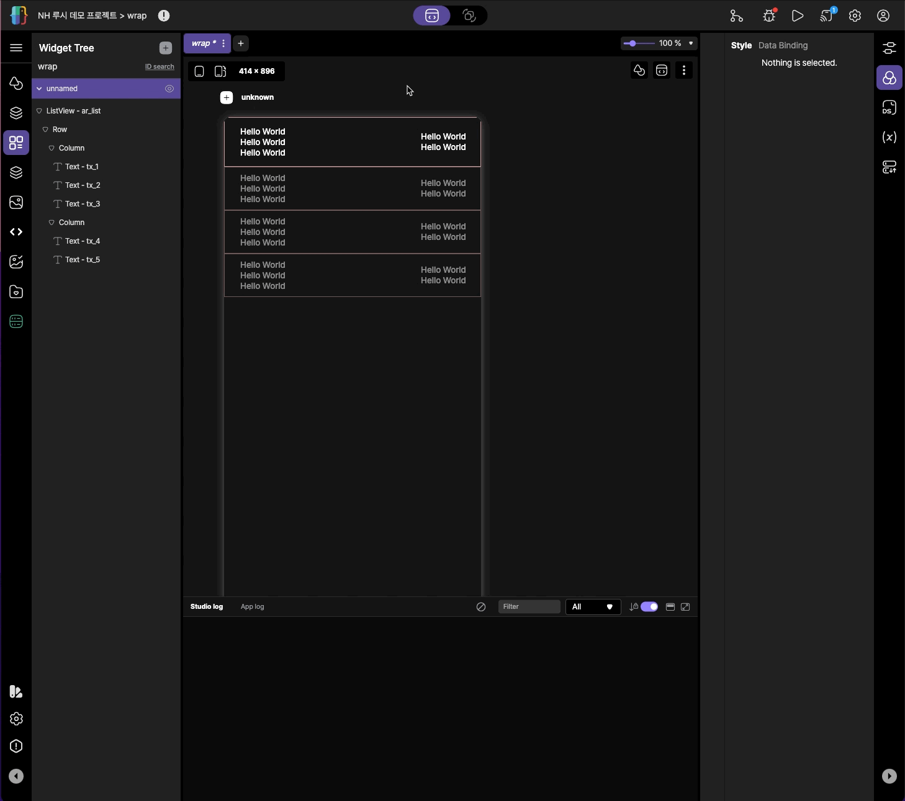
   
   

 
 
7. 실행을 위해 화면이 열릴때 해당 액션을 실행합니다. 액션의 명칭은 "LoadFile" 입니다.
  스크립트 창에 해당액션과정을 등록합니다.

>function onStart() {
>
>    $act.executeAction("LoadFile"); 
>
>}

