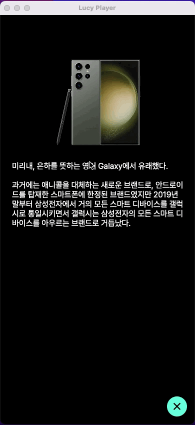

# openPage
화면 A 에서 화면 B 를 엽니다. 먼저 페이지 A에서 해당 액션을 잡아둡니다.
   

현재 경로를 확인합니다. Manual 폴더에 열게될 파일이 저장되어있습니다.  
현재 페이지 : mainPage  
열리는 페이지 : firstPage

위치를 기본위치에서 전체를 지정한 Manual/firstPage 입니다.
   
>
  

   
이미지를 선택하면 새로운 창이 열리는 액션을 실행하기 위한 이벤트를 입력합니다.  
먼저 이미지를 선택후 Style 에서 "GestureDetector" 를 선택합니다.  
onTap 을 선택해서 이미 만들어둔 액션 "OpenPage" 를 선택합니다.
   
>
  

Lucy Player 를 실행해서 동작을 확인합니다.
   

  

